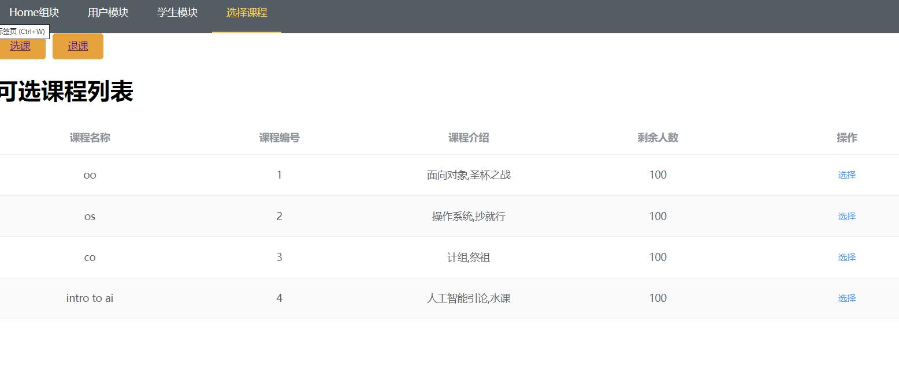
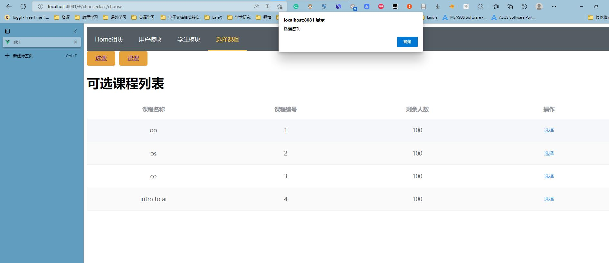
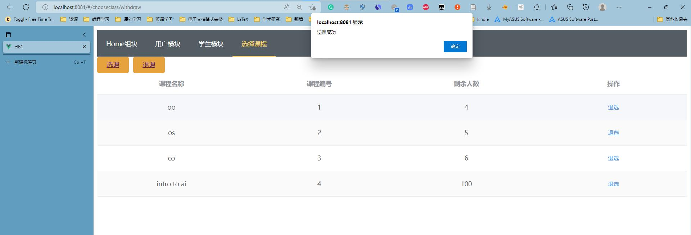

# zlb1

## Project setup
```
npm install
```

### Compiles and hot-reloads for development
```
npm run serve
```

### Compiles and minifies for production
```
npm run build
```

### Lints and fixes files
```
npm run lint
```


# 选课界面

- 选课界面



- 选课成功提示



- 退课界面


- 退课成功



