# 任务1设计文档

## 项目结构

```python
.
├── README.md		
├── design.md		# 设计报告
├── pictures		# 设计报告图片
└── src
    ├── backend	
    │   ├── database.sql	# 数据库初始化脚本
    │   ├── mysql.py		# pymysql数据库交互函数
    │   ├── urls.py			# URL转发逻辑
    │   ├── views.py		# 后端API
    |	└── ...
    ├── buaa_db
    │   ├── settings.py		# 项目设置
    │   ├── urls.py			# URL转发逻辑
    │   └── ...
    ├── frontend
    │   ├── README.md
    │   ├── babel.config.js
    │   ├── img
    │   ├── jsconfig.json
    │   ├── node_modules
    │   ├── package-lock.json
    │   ├── package.json
    │   ├── public
    │   ├── src
    │   └── vue.config.js
    └── manage.py

```


## 后端实现

后端采用`django`框架，使用前后端分离组件`rest_framework`。数据库采用`mySql`，使用`pymysql`与数据库交互。

## 数据库概念模式设计

### 实体E-R图





### 联系E-R图


## 逻辑模式设计

### 数据库关系模式

关系模式形式化表示为$R(U,D,DOM,F)$,$U$为组成该关系的属性名，$D$为U中属性所来自的域，$DOM$为属性与域的映射，$F$为属性间的依赖关系集合。约定$N$表示正整数，$FLOAT$表示浮点数，$L$为任意字符组成的字符串，$T$表示时间，$B$表示布尔值，主码以下划线标识，$*$代表一个实体中所有属性。

#### 实体

- 学生：$student<\{\underline{学号}，密码，用户名，年级，班级\}，D,DOM,F>$,其中$D=\{L,N\}$,$DOM=\{DOM(用户名)=L,DOM(学号)=N,DOM(密码)=N,DOM(年级)=N,DOM(班级)=N\}$,$F=\{学号 \rightarrow *\}$

- 课程：$course<\{\underline{课程ID}，课程名，课程介绍，课程容量，已选人数\},D,DOM,F>$,其中$D=\{N,L\}$,$DOM=\{DOM(课程ID)=N,DOM(课程名)=L,DOM(课程介绍)=L\}$，$F=\{课程ID\rightarrow *\}$

#### 联系

- 学生选择课程：$student\_course<\{\underline{学生ID},\underline{课程ID}\},D,DOM,F>$

### 关系模式等级的判定与规范化

略


## 数据库基本表定义

### 实体表

#### 学生表 students

| 字段名称         | 数据类型 | 字段大小 | 必填字段 | 主键 | 外键 | 说明     |
| ---------------- | -------- | -------- | -------- | ---- | ---- | -------- |
| student_id       | int      | 20       | 是       | 是   | 否   | 学号     |
| student_password | varchar  | 255      | 是       | 否   | 否   | 登录密码 |
| student_username | varchar  | 255      | 是       | 否   | 否   | 用户名   |
| student_grade    | int      | 20       | 是       | 否   | 否   | 年级     |
| student_class    | int      | 20       | 是       | 否   | 否   | 班级     |

#### 课程表 courses

| 字段名称        | 数据类型 | 字段大小 | 必填字段 | 主键 | 外键 | 说明     |
| --------------- | -------- | -------- | -------- | ---- | ---- | -------- |
| course_id       | int      | 20       | 是       | 是   | 否   | 课程ID   |
| course_name     | varchar  | 255      | 是       | 否   | 否   | 课程名   |
| course_intro    | varchar  | 10000    | 是       | 否   | 否   | 课程评价 |
| course_capacity | int      | 20       | 是       | 否   | 否   | 课程容量 |
| course_elected  | int      | 20       | 是       | 否   | 否   | 已选人数 |

### 联系表

#### 学生选择课程 

| 字段名称   | 数据类型 | 字段大小 | 必填字段 | 主键 | 外键 | 说明   |
| ---------- | -------- | -------- | -------- | ---- | ---- | ------ |
| student_id | int      | 20       | 是       | 是   | 是   | 学号   |
| course_id  | int      | 20       | 是       | 是   | 是   | 课程id |


## 前后端交互API

### studentRegister

frontend->backend

| key              | value | 说明 |
| ---------------- | ----- | ---- |
| student_id       |       | int  |
| student_password |       | char |
| student_username |       | char |
| student_grade    |       | int  |
| student_class    |       | int  |

backend->frontend

| key    | value   | 说明                              |
| ------ | ------- | --------------------------------- |
| status | success | 成功注册返回success，否则返回fail |
|        | fail    |                                   |

#### SQL语句

```python
    sql = "INSERT INTO students(student_id, student_password, \
          student_username, student_grade, student_class) \
          VALUES (%s, %s, %s, %s, %s) "
```


### studentLogin

frontend->backend

| key              | value | 说明 |
| ---------------- | ----- | ---- |
| student_id       |       | int  |
| student_password |       | char |

backend->frontend

| key    | value                  | 说明                                 |
| ------ | ---------------------- | ------------------------------------ |
| status | success                | 成功登录                             |
|        | student_id_not_found   | 学生id未在数据库中找到               |
|        | student_password_wrong | 学生id在数据库中找到了，但是密码错误 |

#### SQL语句

```python
sql = "SELECT * FROM students WHERE student_id=%s"
```


### studentCurriculum

frontend->backend

| key        | value |      |
| ---------- | ----- | ---- |
| student_id |       | int  |

backend->frontend


#### SQL语句

```python
    sql = "SELECT * FROM courses WHERE course_id NOT IN ( \
      SELECT course_id FROM student_course WHERE student_id = %s)"
```


### studentCourseSelection

frontend->backend

| key        | value |      |
| ---------- | ----- | ---- |
| student_id |       | int  |
| course_id  |       | int  |

backend->frontend

| key    | value |         |
| ------ | ----- | ------- |
| status |       | success |
|        |       | fail    |

#### SQL语句

```python
    sql = "INSERT INTO student_course(student_id, course_id) \
      VALUES (%s, %s)"
```


### studentCoursePost

frontend->backend

| key        | value |      |
| ---------- | ----- | ---- |
| student_id |       | int  |

backend->frontend


#### SQL语句

```python
    sql = "SELECT * FROM courses WHERE course_id IN ( \
      SELECT course_id FROM student_course WHERE student_id = %s)"
```


### studentCourseWithdraw

frontend->backend

| key        | value |      |
| ---------- | ----- | ---- |
| student_id |       | int  |
| course_id  |       | int  |

backend->frontend

| key    | value   |        |
| ------ | ------- | ------ |
| status | success | 字符串 |
|        | fail    |        |

#### SQL语句

```python
    sql = "DELETE FROM student_course WHERE student_id=%s AND course_id=%s"
```

