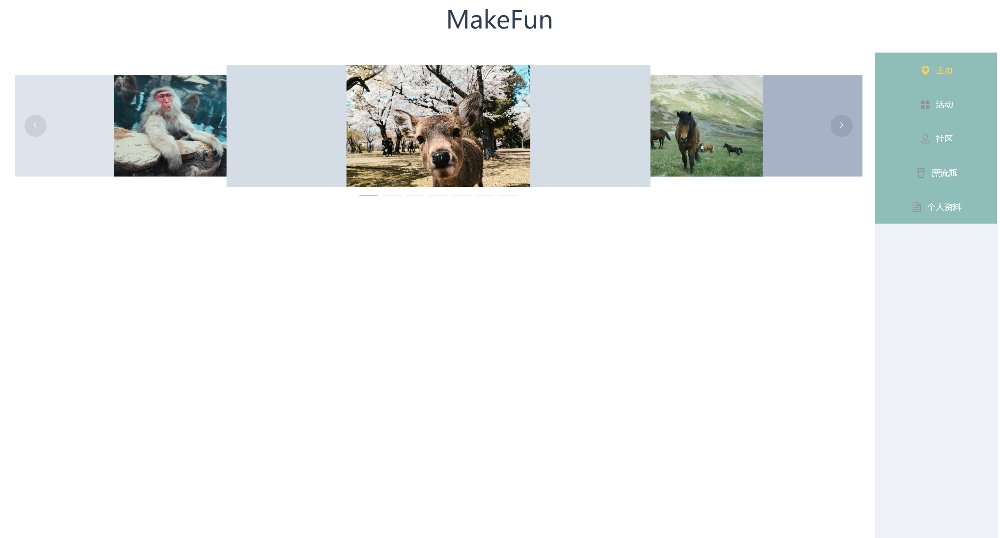
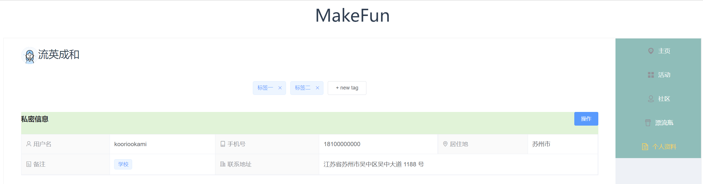
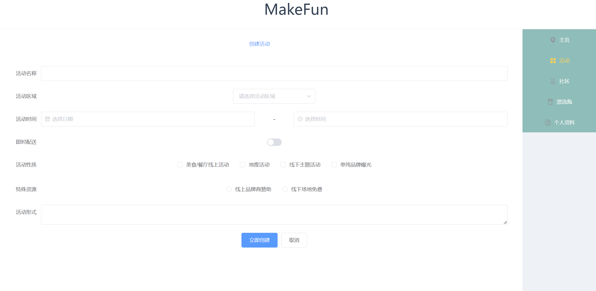

## 前后端交互API

- 前端保存userId作为用户标识。

## Home



## 个人主页



**修改或获取个人页面信息**

```
url: '/api/changeUserInfo',
front->back
{
    "userId" : string,
	"userName" : string,
    "contact" : string,
	"gender" : string,
	"age" : string,
    "address" : string
}
back->end
{
    "status" : string # success 或者 fail  可以忽略
}
```

```
url: '/api/userAddTag',
front->back
{
	"userId" : string
	"tagName" : string
}
back->front
{
	"status": string	# 可以忽略
}
```

```
url: '/api/getUserTag'
front->back
{
	"userId" : string
}
back->front
{
	"dynamicTags" : list[string]
}
```

```
url: '/api/userDeleteTag'
front->back
{
	"userId" : string,
	"tagName" : string
}
```

```
url: '/api/getUserInfo',
front->end
{
	"userId" : string
}
end->front
{	
	"userName" : string,
	"contact" : string,
	"gender" : string,
	"age" : string,
	"address" : string
}
```

## 活动页面



```
url: '/api/createActivity',
front->end
{
	"name" : string,
	"desc" : string,
	"beginDate" : sting,
    "endDate" : string,
    "region" : string,
    "activityNature" : string,
    "userId" : string,
}
end->front
{
	"status" : string # 可以忽略
}
```

```
url: '/api/getActivity',
front->end
{
	
}
end->front
{
     activities:  list[ dict {
                name: string,
                desc: string,
                beginDate: sting,
                endDate: string,
                region: string,  
                activitieNature: string,
       		 } ]
}
```


## 漂流瓶主页面（DriftBottles）

```
url: 'api/getOneRandomDriftBottleContent'
front->end
{
	"userId" : string,
}
end->front
{
	"content" : string 
}
```

```
url: 'api/getMySendDriftBottles'
front->end
{
	"userId" : string
}
end->front
{
	"bottles" : [
		{
			"content" : string
		}
	]
}
```

```
url: 'api/getMyReceivedBottleReplys'
front->end
{
	"userId" : string
}
end->front
{
	"bottlesAndReplys" : [
		{
			"content" : string,
			"reply" : string,
			"replyUserId" : string
		}
	]
}
```

```
url: 'api/agreeWithReply'
front->end 
{
	"userId" :string,
	"replyUserId" : string
}
end->front
{
	"status" : success 
}
```

```
url: 'api/getMyRepliedBottles'
front->end
{
	"userId" :string
}
end->front
{
	"bottles" : [
		{
			"content" : string,
			"myReply" :string
		}
	]
}
```

```
url: 'api/sendText'
front->end
{
	"userId" : string,
	"content" : string
}
end->front
{
	"status" : success / fail
}
```

```
url: 'api/sendReplyText'
front->end
{
	"userId" : string,
	"bottleId" : string,
	"content" : string,
}
back->front
{
	"status" : success / fail
}
```


## 登录页面

```
url: 'api/userLogin'
front->end
{
	"name" : string
	"password" : string
}
back->front
{
	"status": "success",
	"status": "not_found",
	"status": "password_wrong"
	"userId" : int
}
```


## 注册页面

```
url: 'api/userRegister'
front->end
{
	"name" : string,
	"password" : string,
	"contact" : string,	
	"gender" : string,	
    "age" : string,		
    "address" : sting,
    "pic" : file
}
end->front
{
	"status" : "unknown_fail",	# 未知错误
	"status" : "name has an account registered. please log in."		# 已注册
	"status" : "success"		
}
```


## 社区页面


```
url: 'api/getHotGroupPic'
front-end
{
	"userId" : string
}
end->front
{
	"groups" : [
		{
			"groupId" : string, 
			"pic" : string,	# 先不实现
			"name" : string
		},
		
	]
}
```

```
url: 'api/getHotGroupIntro'
front->end
{
	"userId" : string
}
end->front
{
	"groups" : [
		{
			"groupId" : string, 
			"name" : string, 
			"desc" : string,
			"tags" : [ "xxx", "xxx"]
		},
	]
}
```

```
url: 'api/userAddGroup'
front->end
{
	"userId" : string
	"group_name" : string,
	"group_desc" : string,
}
end->front
{
	"status" : "success"
}
```

```
url: 'api/userDeleteGroup' # 只有创建者可以删除
front->end
{
	"userId" : string,
	"groupId" : string
}
end->front
{
	"status" : success / fail
}
```


## 圈子页面


```
url: 'api/getGroupInfo'
front->end
{
	"groupId" : string
}
end->front
{
	"group_name" : string,
	"group_desc" : string,
	"post_num" : string,
	"create_user_name" : string,
	"create_user_pic" : string,
	"tags" : [ "xxx", "xxx"],
	"posts" : [
		{
			"post_id" : string,
			"post_name" : string,
			"content" : string,
            "post_time" : string,
            "comment_num" : string,
            "likes_num" : string,
            "create_user_name" : string,
            "create_user_pic" : string,
		}
		
	]
}
```

```
url: 'api/userCreatePost'
front->end
{
	"userId" : string,
	"groupId" : string,
	"post_name" : string,
	"content" : string,
	"post_time" : sting
}
end->front
{
	"status" : "success"
}
```

```
url: 'api/userDeletePost'	#只有创建者可以删除
front->end
{
	"userId" : string,
	"postId" : string
}
end->front
{
	"status" : success / fail
}
```

```
url: 'api/userAddTagToGroup'
front->end
{
	"userId" : string,
	"groupId": string,
	"tagName" : string
}
end->front
{
	"status" : "success"
}
```


## 帖子


```
url: 'api/getPostInfo'
front->end
{
	"postId" : string
}
end->front
{
	"post_name" : string,
	"content" : string,
	"post_time" : string,
	"comment_num" : string,
	"likes_num" : string,
	"create_user_name" : string,
	"create_user_pic" : string,
	"comments" : [
		{
			"comment_id" : string,
			"content" : string,
			"comment_time" : string,
			"likes_num" : string,
			"comment_user_id" : string,
			"comment_user_pic" : string,
		}
	]
}
```

```
url: 'api/userLikePost'
front->end
{
	"userId" : string,
	"postId" : string
}
end->front
{
	"status" : success
}
```

```
url: 'api/userLikeComment'
front->end
{
	"userId" : string,
	"commentId" : string
}
end->front
{
	"status" : success
}
```

```
url: 'api/userCreateComment'
front->end
{
	"userId" : string,
	"postId" : string,
	"content" :string,
	"comment_time" : string
}
end-front
{
	"status" :success
}
```

```
url: 'api/userDeleteComment'
front->end
{
	"userId" : string,
	"commentId" : string
}
end->front
{
	"status" : success / fail
}
```


## 好友列表

```
url: 'api/getFriendsList'
front->end
{
	"userId" : string
}
end-front
{
	"friends" : [
		{
			"userId" : string,
			"name" : string,
			"pic" : string	# 暂时不实现
		}
	]
}
```


## 头像

```
url: 'api/uploadUserProfilePic' #上传图片至服务器
front->end
{
	"userId" : string,
	"pic" : file  
}
end->front
{
	"status" success / fail
}
```

```
url: 'api/previewUserProfilePic' # 前端获取图片
front->end
{
	"userId" : string
}
end->front
{
	"pic_path" : string
}
```

