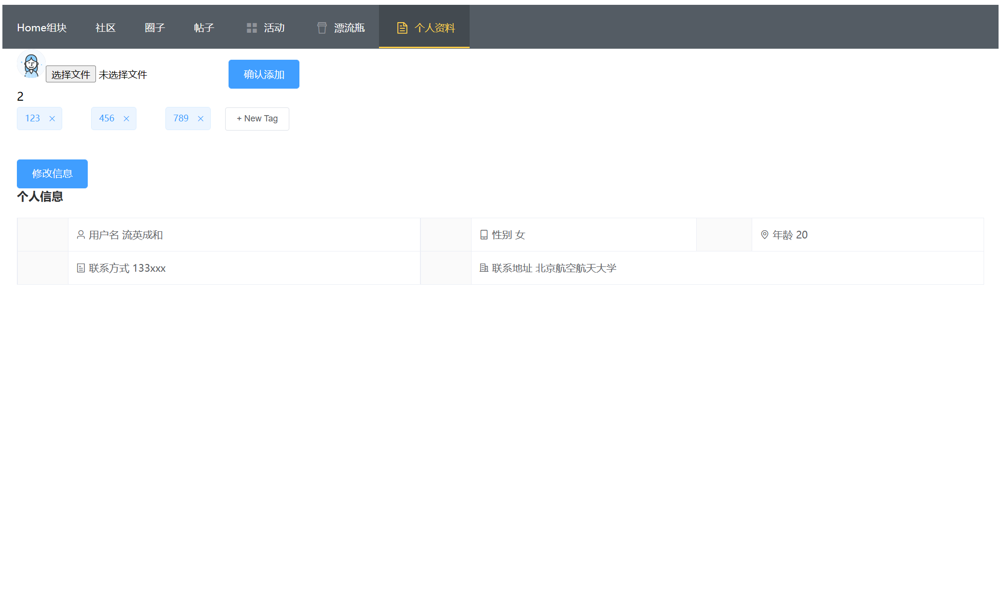
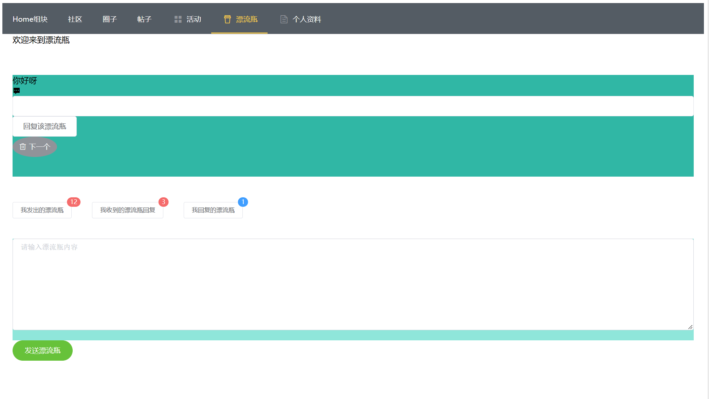
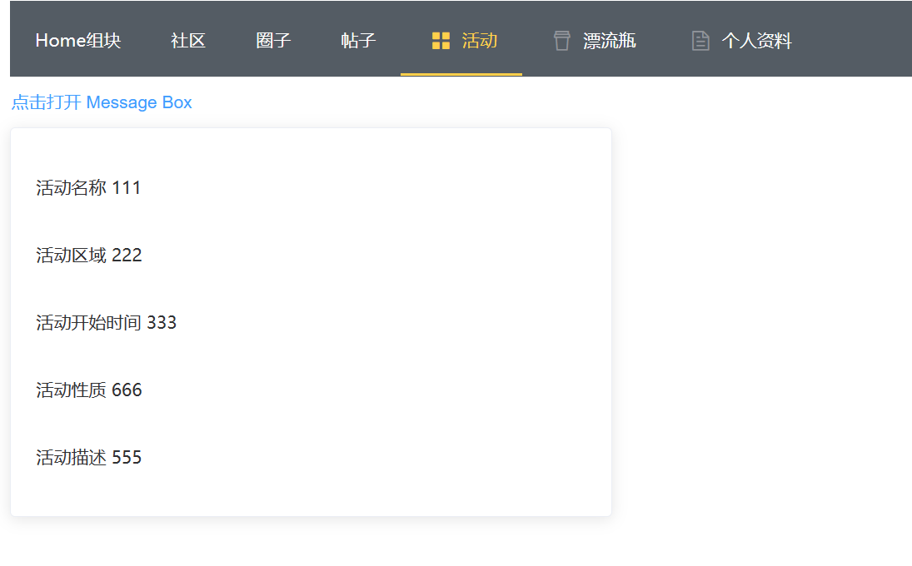
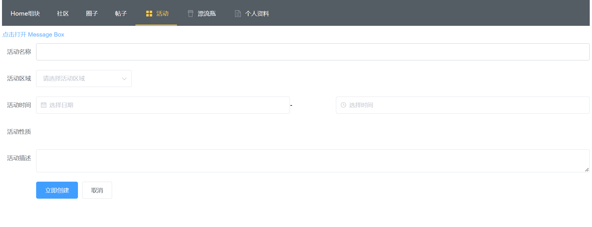

## 一. 系统结构设计

### 1.环境与框架

#### 1.1 前端

|    Web 框架    |   Vue.js   | 2.6.11  |
| :------------: | :--------: | :-----: |
|    开发工具    |  Vue-cli   | 4.5.15  |
|    Js解释器    |  node.js   | 16.14.0 |
| 软件包管理工具 |    npm     |  8.3.1  |
|   网络请求库   |   axios    | 0.27.2  |
|     美化库     | element-ui | 2.15.10 |
| Vue.js状态管理 |    vuex    |  3.4.0  |

#### 1.2 后端及数据库


### 2.体系结构

本系统采用前后端以及数据库分离的体系结构。前端基础页面为静态资源，通过与用户交互向后端发送修改数据请求，并获取修改结果；后端接受前端请求，根据请求对数据库进行增删改查，并返回请求结果至前端；数据库存储并管理数据。具体结构如下：

#### 2.1 前端

- 前端静态页面选择由HTML+CSS+JavaScript组成。HTML搭建文档的结构，创建页面的骨架；CSS用于设置文档的呈现效果，控制页面的样式；JavaScrip实现文档的行为，控制页面的行为。
- 前端主体框架为vue.js，由vue-cli脚手架搭建完成，方便实现复杂页面。
- 前端内部数据的存储使用vuex实现，用户登录后前端保有其登录信息，保证后续操作限制在登录信息的条件下。
- 前端页面还使用element-ui库进行页面优化。

#### 2.2 前后端交互

- 前后端合并时，采用axios进行对接，通过GET、POST请求实现前后端交互。

#### 2.3 后端


#### 2.4 数据库


## 二. 系统功能结构图


## 三. 基本表定义

### 实体表

#### 用户（user）

| 字段名称      | 数据类型 | 字段大小 | 必填字段 | 主键 | 外键 | 说明                       |
| ------------- | -------- | -------- | -------- | ---- | ---- | -------------------------- |
| user_id       | int      | 20       | 是       | 是   | 否   | 自增主键                   |
| name          | varchar  | 255      | 是       | 否   | 否   | 用户名,唯一                |
| password      | varchar  | 255      | 是       | 否   | 否   | 密码                       |
| head_portrait | varchar  | 255      | 否       | 否   | 否   | 存放头像在文件系统中的路径 |
| contact       | varchar  | 255      | 否       | 否   | 否   | 联系方式                   |
| gender        | varchar  | 255      | 否       | 否   | 否   | 性别                       |
| age           | int      | 20       | 否       | 否   | 否   | 年龄                       |
| address       | varchar  | 255      | 否       | 否   | 否   | 地址                       |

#### 圈子（group）

| 字段名称   | 数据类型 | 字段大小 | 必填字段 | 主键 | 外键 | 说明           |
| ---------- | -------- | -------- | -------- | ---- | ---- | -------------- |
| group_id   | int      | 20       | 是       | 是   | 否   | 自增主键       |
| post_num   | int      | 20       | 是       | 否   | 否   | 帖子个数       |
| group_name | varchar  | 255      | 是       | 否   | 否   | 圈子名         |
| group_desc | varchar  | 1000     | 是       | 否   | 否   | 圈子描述       |
| user_id    | int      | 20       | 是       | 否   | 是   | 发起用户的id   |
| pic        | varchar  | 255      | 是       | 否   | 否   | 圈子图像的路径 |

#### 帖子（post）

| 字段名称    | 数据类型 | 字段大小 | 必填字段 | 主键 | 外键 | 说明       |
| ----------- | -------- | -------- | -------- | ---- | ---- | ---------- |
| post_id     | int      | 20       | 是       | 是   | 否   | 自增主键   |
| name        | varchar  | 255      | 是       | 否   | 否   | 帖子名     |
| content     | varchar  | 10000    | 是       | 否   | 否   | 帖子内容   |
| post_time   | varchar  | 255      | 是       | 否   | 否   | 发帖时间   |
| comment_num | int      | 20       | 是       | 否   | 否   | 评论个数   |
| likes_num   | int      | 20       | 是       | 否   | 否   | 赞个数     |
| user_id     | int      | 20       | 是       | 否   | 是   | 发贴用户id |
| group_id    | int      | 20       | 是       | 否   | 是   | 所属圈子id |

#### 评论（comment）

| 字段名称     | 数据类型 | 字段大小 | 必填字段 | 主键 | 外键 | 说明             |
| ------------ | -------- | -------- | -------- | ---- | ---- | ---------------- |
| comment_id   | int      | 20       | 是       | 是   | 否   | 自增主键         |
| content      | varchar  | 10000    | 是       | 否   | 否   | 评论内容         |
| comment_time | varchar  | 255      | 是       | 否   | 否   | 评论时间         |
| likes_num    | int      | 20       | 是       | 否   | 否   | 赞个数           |
| user_id      | int      | 20       | 是       | 否   | 是   | 发表评论的用户id |
| post_id      | int      | 20       | 是       | 否   | 是   | 所属帖子id       |

#### 漂流瓶（bottle）

| 字段名称  | 数据类型 | 字段大小 | 必填字段 | 主键 | 外键 | 说明       |
| --------- | -------- | -------- | -------- | ---- | ---- | ---------- |
| bottle_id | int      | 20       | 是       | 是   | 否   | 自增主键   |
| content   | varchar  | 10000    | 是       | 否   | 否   | 漂流瓶内容 |
| user_id   | int      | 20       | 是       | 否   | 是   | 发送者id   |

#### 漂流瓶回复（bottle_reply）

| 字段名称        | 数据类型 | 字段大小 | 必填字段 | 主键 | 外键 | 说明             |
| --------------- | -------- | -------- | -------- | ---- | ---- | ---------------- |
| bottle_reply_id | int      | 20       | 是       | 是   | 否   | 自增主键         |
| reply           | varchar  | 10000    | 是       | 否   | 否   | 回复内容         |
| user_id         | int      | 20       | 是       | 否   | 是   | 发起回复的用户id |
| bottle_id       | int      | 20       | 是       | 否   | 是   | 回复给的漂流瓶id |

#### 活动（activity）

| 字段名称        | 数据类型 | 字段大小 | 必填字段 | 主键 | 外键 | 说明         |
| --------------- | -------- | -------- | -------- | ---- | ---- | ------------ |
| activity_id     | int      | 20       | 是       | 是   | 否   | 自增主键     |
| name            | varchar  | 255      | 是       | 否   | 否   | 活动名       |
| summary         | varchar  | 1000     | 是       | 否   | 否   | 活动概述     |
| begin_time      | varchar  | 255      | 是       | 否   | 否   | 活动开始时间 |
| end_time        | varchar  | 255      | 是       | 否   | 否   | 活动结束时间 |
| location        | varchar  | 255      | 是       | 否   | 否   | 活动地点     |
| activity_nature | varchar  | 255      | 是       | 否   | 否   | 活动性质     |
| user_id         | int      | 20       | 是       | 否   | 是   | 发起者id     |

#### 聊天消息（message）

| 字段名称   | 数据类型 | 字段大小 | 必填字段 | 主键 | 外键 | 说明     |
| ---------- | -------- | -------- | -------- | ---- | ---- | -------- |
| message_id | int      | 20       | 是       | 是   | 否   | 自增主键 |
| content    | varchar  | 255      | 是       | 否   | 否   | 消息内容 |
| send_time  | varchar  | 255      | 是       | 否   | 否   | 发送时间 |
| send_id    | int      | 20       | 是       | 否   | 是   | 发送者id |
| receive_id | int      | 20       | 是       | 否   | 是   | 接收者id |

#### 兴趣标签（tag）

| 字段名称 | 数据类型 | 字段大小 | 必填字段 | 主键 | 外键 | 说明     |
| -------- | -------- | -------- | -------- | ---- | ---- | -------- |
| tag_id   | int      | 20       | 是       | 是   | 否   | 自增主键 |
| tag_name | varchar  | 255      | 是       | 否   | 否   | 标签名   |

### 联系表

#### 用户点赞评论（user_like_comment）

| 字段名称   | 数据类型 | 字段大小 | 必填字段 | 主键 | 外键 | 说明         |
| ---------- | -------- | -------- | -------- | ---- | ---- | ------------ |
| user_id    | int      | 20       | 是       | 是   | 是   | 点赞用户id   |
| comment_id | int      | 20       | 是       | 是   | 是   | 被点赞评论id |

#### 用户点赞帖子（user_like_post）

| 字段名称 | 数据类型 | 字段大小 | 必填字段 | 主键 | 外键 | 说明         |
| -------- | -------- | -------- | -------- | ---- | ---- | ------------ |
| user_id  | int      | 20       | 是       | 是   | 是   | 点赞用户id   |
| post_id  | int      | 20       | 是       | 是   | 是   | 被点赞帖子id |

#### 用户具有的兴趣标签（user_tag）

| 字段名称 | 数据类型 | 字段大小 | 必填字段 | 主键 | 外键 | 说明   |
| -------- | -------- | -------- | -------- | ---- | ---- | ------ |
| user_id  | int      | 20       | 是       | 是   | 是   | 用户id |
| tag_id   | int      | 20       | 是       | 是   | 是   | 标签id |

#### 圈子具有的兴趣标签（group_tag）

| 字段名称 | 数据类型 | 字段大小 | 必填字段 | 主键 | 外键 | 说明   |
| -------- | -------- | -------- | -------- | ---- | ---- | ------ |
| group_id | int      | 20       | 是       | 是   | 是   | 圈子id |
| tag_id   | int      | 20       | 是       | 是   | 是   | 标签id |

#### 用户好友关系（user_user）

| 字段名称 | 数据类型 | 字段大小 | 必填字段 | 主键 | 外键 | 说明   |
| -------- | -------- | -------- | -------- | ---- | ---- | ------ |
| user1_id | int      | 20       | 是       | 是   | 是   | 用户id |
| user2_id | int      | 20       | 是       | 是   | 是   | 用户id |

#### 用户参与活动（user_activity）

| 字段名称    | 数据类型 | 字段大小 | 必填字段 | 主键 | 外键 | 说明   |
| ----------- | -------- | -------- | -------- | ---- | ---- | ------ |
| user_id     | int      | 20       | 是       | 是   | 是   | 用户id |
| activity_id | int      | 20       | 是       | 是   | 是   | 活动id |

#### 用户头像（user_profile_pic）

| 字段名称 | 数据类型 | 字段大小 | 必填字段 | 主键 | 外键 | 说明                       |
| -------- | -------- | -------- | -------- | ---- | ---- | -------------------------- |
| pic_id   | int      | 20       | 是       | 是   | 否   | 自增主键                   |
| user_id  | int      | 20       | 是       | 否   | 是   | 用户id                     |
| pic_path | varchar  | 255      | 是       | 否   | 否   | 图片在文件系统中存放的路径 |

### 建立数据库脚本

```sql
-- 使用分号作为结束符
delimiter ;
-- 如果存在数据库就先删除
DROP DATABASE buaa_db2;
CREATE DATABASE if not exists buaa_db2 DEFAULT CHARACTER SET utf8 COLLATE utf8_general_ci;
USE buaa_db2;

-- 删除表
DROP TABLE IF EXISTS `user`;
DROP TABLE IF EXISTS `group`;
DROP TABLE IF EXISTS `post`;
DROP TABLE IF EXISTS `comment`;
DROP TABLE IF EXISTS `bottle`;
DROP TABLE IF EXISTS `bottle_reply`;
DROP TABLE IF EXISTS `activity`;
DROP TABLE IF EXISTS `message`;
DROP TABLE IF EXISTS `tag`;
DROP TABLE IF EXISTS `user_like_comment`;
DROP TABLE IF EXISTS `user_like_post`;
DROP TABLE IF EXISTS `user_tag`;
DROP TABLE IF EXISTS `group_tag`;
DROP TABLE IF EXISTS `user_user`;
DROP TABLE IF EXISTS `user_activity`;
DROP TABLE IF EXISTS `user_profile_pic`;

-- init table
-- 新建user表，user_id是自增主键
CREATE TABLE `user`
(
  `user_id`       INT(20)       NOT NULL AUTO_INCREMENT PRIMARY KEY ,
  `name`          VARCHAR(255)  NOT NULL UNIQUE ,
  `password`      VARCHAR(255)  NOT NULL ,
  `head_portrait` VARCHAR(255) ,
  `contact`       VARCHAR(255) ,
  `gender`        VARCHAR(255) ,
  `age`           INT(20) ,
  `address`       VARCHAR(255)

)ENGINE=InnoDB DEFAULT CHARSET=utf8;

-- 新建group表，其中user_id是外键，group_id是自增主键。
CREATE TABLE `group`
(
  `group_id`          INT(20)       NOT NULL AUTO_INCREMENT PRIMARY KEY ,
  `post_num`          INT(20)       NOT NULL ,
  `group_name`        VARCHAR(255)  NOT NULL ,
  `group_desc`        VARCHAR(1000) NOT NULL ,
  `user_id`           INT(20)       NOT NULL ,
  FOREIGN KEY(`user_id`) REFERENCES `user`(`user_id`)

)ENGINE=InnoDB DEFAULT CHARSET=utf8;
-- 新建post表，post_id是自增主键，user_id，group_id是外键
CREATE TABLE `post`
(
  `post_id`     INT(20)         NOT NULL AUTO_INCREMENT PRIMARY KEY ,
  `name`        VARCHAR(255)    NOT NULL ,
  `content`     VARCHAR(10000)  NOT NULL ,
  `post_time`   VARCHAR(255)    NOT NULL ,
  `comment_num` INT(20)         NOT NULL ,
  `likes_num`   INT(20)         NOT NULL ,
  `user_id`     INT(20)         NOT NULL ,
  `group_id`    INT(20)         NOT NULL ,
  FOREIGN KEY(`user_id`) REFERENCES `user`(`user_id`) ,
  FOREIGN KEY(`group_id`) REFERENCES `group`(`group_id`)

)ENGINE=InnoDB DEFAULT CHARSET=utf8;
-- 新建评论表，comment_id是自增主键，user_id，post_id是外键
CREATE TABLE `comment`
(
  `comment_id`    INT(20)         NOT NULL AUTO_INCREMENT PRIMARY KEY ,
  `content`       VARCHAR(10000)  NOT NULL ,
  `comment_time`  VARCHAR(255)    NOT NULL ,
  `likes_num`     INT(20)         NOT NULL ,
  `user_id`       INT(20)         NOT NULL ,
  `post_id`       INT(20)         NOT NULL ,
  FOREIGN KEY(`user_id`) REFERENCES `user`(`user_id`) ,
  FOREIGN KEY(`post_id`) REFERENCES `post`(`post_id`)

)ENGINE=InnoDB DEFAULT CHARSET=utf8;
-- 新建bottle表，bottle_id是自增主键，user_id是外键
CREATE TABLE `bottle`
(
  `bottle_id` INT(20)         NOT NULL AUTO_INCREMENT PRIMARY KEY ,
  `content`   VARCHAR(10000)  NOT NULL ,
  `user_id`   INT(20)         NOT NULL ,
  FOREIGN KEY(`user_id`) REFERENCES `user`(`user_id`) 

)ENGINE=InnoDB DEFAULT CHARSET=utf8;
-- 新建bottle_reply表，bottle_reply_id是自增主键，
-- user_id，bottle_id是外键
CREATE TABLE `bottle_reply`
(
  `bottle_reply_id` INT(20)         NOT NULL AUTO_INCREMENT PRIMARY KEY ,
  `reply`           VARCHAR(10000)  NOT NULL ,
  `user_id`         INT(20)         NOT NULL ,
  `bottle_id`       INT(20)         NOT NULL ,
  FOREIGN KEY(`user_id`) REFERENCES `user`(`user_id`) ,
  FOREIGN KEY(`bottle_id`) REFERENCES `bottle`(`bottle_id`)

)ENGINE=InnoDB DEFAULT CHARSET=utf8;
-- 新建activity表,activity_id是自增主键,user_id是外键.
CREATE TABLE `activity`
(
  `activity_id` INT(20)         NOT NULL AUTO_INCREMENT PRIMARY KEY ,
  `name`        VARCHAR(255)    NOT NULL ,
  `summary`     VARCHAR(1000)   NOT NULL ,
  `begin_time`  VARCHAR(255)    NOT NULL ,
  `end_time`    VARCHAR(255)    NOT NULL ,
  `location`    VARCHAR(255)    NOT NULL ,
  `activity_nature` VARCHAR(255) NOT NULL, 
  `user_id`     INT(20)         NOT NULL ,
  FOREIGN KEY(`user_id`) REFERENCES `user`(`user_id`) 

)ENGINE=InnoDB DEFAULT CHARSET=utf8; 

CREATE TABLE  `message`
(   
  `message_id`  INT(20)         NOT NULL AUTO_INCREMENT PRIMARY KEY ,
  `content`     VARCHAR(10000)  NOT NULL ,
  `send_time`   VARCHAR(255)    NOT NULL ,
  `send_id`     INT(20)         NOT NULL ,
  `receive_id`  INT(20)         NOT NULL ,
  FOREIGN KEY(`send_id`) REFERENCES `user`(`user_id`) ,
  FOREIGN KEY(`receive_id`) REFERENCES `user`(`user_id`) 

)ENGINE=InnoDB DEFAULT CHARSET=utf8; 

CREATE TABLE  `tag`
(
  `tag_id`    INT(20)       NOT NULL AUTO_INCREMENT PRIMARY KEY ,
  `tag_name`  VARCHAR(255)  NOT NULL 

)ENGINE=InnoDB DEFAULT CHARSET=utf8; 

CREATE TABLE  `user_like_comment`
(
  `user_id`     INT(20)       NOT NULL,
  `comment_id`  INT(20)       NOT NULL,
  FOREIGN KEY(`user_id`) REFERENCES `user`(`user_id`) ,
  FOREIGN KEY(`comment_id`) REFERENCES `comment`(`comment_id`) ,
  PRIMARY KEY(`user_id`, `comment_id`)
)ENGINE=InnoDB DEFAULT CHARSET=utf8; 

CREATE TABLE  `user_like_post`
(
  `user_id` INT(20)       NOT NULL , 
  `post_id` INT(20)       NOT NULL , 
  FOREIGN KEY(`user_id`) REFERENCES `user`(`user_id`) ,
  FOREIGN KEY(`post_id`) REFERENCES `post`(`post_id`) ,
  PRIMARY KEY(`user_id`, `post_id`)
)ENGINE=InnoDB DEFAULT CHARSET=utf8; 

CREATE TABLE  `user_tag`
(
  `user_id`   INT(20)       NOT NULL ,  
  `tag_id`  INT(20)       NOT NULL , 
  FOREIGN KEY(`user_id`) REFERENCES `user`(`user_id`) ,
  FOREIGN KEY(`tag_id`) REFERENCES `tag`(`tag_id`) ,
  PRIMARY KEY(`user_id`, `tag_id`)
)ENGINE=InnoDB DEFAULT CHARSET=utf8; 

CREATE TABLE  `group_tag`
(
  `group_id`  INT(20)       NOT NULL ,
  `tag_id`  INT(20)       NOT NULL ,
  FOREIGN KEY(`group_id`) REFERENCES `group`(`group_id`) ,
  FOREIGN KEY(`tag_id`) REFERENCES `tag`(`tag_id`) ,
  PRIMARY KEY(`group_id`, `tag_id`)

)ENGINE=InnoDB DEFAULT CHARSET=utf8; 

CREATE TABLE  `user_user`
(
  `user1_id` INT(20)       NOT NULL ,
  `user2_id` INT(20)       NOT NULL ,
  FOREIGN KEY(`user1_id`) REFERENCES `user`(`user_id`) ,
  FOREIGN KEY(`user2_id`) REFERENCES `user`(`user_id`) ,
  PRIMARY KEY(`user1_id`, `user2_id`)

)ENGINE=InnoDB DEFAULT CHARSET=utf8; 

CREATE TABLE  `user_acitivity`
(
  `user_id`     INT(20)       NOT NULL ,
  `activity_id` INT(20)       NOT NULL ,
  FOREIGN KEY(`user_id`) REFERENCES `user`(`user_id`) ,
  FOREIGN KEY(`activity_id`) REFERENCES `activity`(`activity_id`) ,
  PRIMARY KEY(`user_id`, `activity_id`)
)ENGINE=InnoDB DEFAULT CHARSET=utf8; 

CREATE TABLE `user_profile_pic`
(
  `pic_id`    INT(20)       NOT NULL AUTO_INCREMENT PRIMARY KEY ,
  `user_id`   INT(20)       NOT NULL UNIQUE ,
  `pic_path`  VARCHAR(255)  NOT NULL,
  FOREIGN KEY(`user_id`) REFERENCES `user`(`user_id`) 
)ENGINE=InnoDB DEFAULT CHARSET=utf8; 
```


## 四. 触发器与存储过程的设计与实现说明

在我们的设计中，触发器的作用主要是用来更新表中的关联信息，以及删除级联关系。

### 更新关联信息触发器

- 对象：group
- 触发条件：当向post表中增加或者删除条目时会触发，若删除一个post，则对应group中post_num会减一，否则加一。

```sql
-- trigger
create trigger `inc_post_num_in_group` after insert on `post` for each row
  update `group` set `post_num`=`post_num` + 1 where `group`.`group_id`=new.`group_id`;

create trigger `dec_post_num_in_group` before delete on `post` for each row
  update `group` set `post_num`=`post_num` - 1 where `group`.`group_id`=old.`group_id`;
```

- 对象：post
- 触发条件：当向comment表中增加或者删除条目时会触发，若删除一个comment，则对应post中comment_num会减一，否则加一。

```sql
create trigger `inc_comment_num_in_post` after insert on `comment` for each row
  update `post` set `comment_num`=`comment_num` + 1 where `post`.`post_id`=new.`post_id`;

create trigger `dec_comment_num_in_post` after delete on `comment` for each row
  update `post` set `comment_num`=`comment_num` - 1 where `post`.`post_id`=old.`post_id`;
```

- 对象post
- 触发条件：当插入或删除user_like_post表时，对应的post条目中likes_num会加一或减一。

```sql
create trigger `inc_likes_num_in_post` after insert on `user_like_post` for each row
  update `post` set `likes_num`=`likes_num` + 1 where `post`.`post_id`=new.`post_id`;

create trigger `dec_likes_num_in_post` after delete on `user_like_post` for each row
  update `post` set `likes_num`=`likes_num` - 1 where `post`.`post_id`=old.`post_id`;
```

- 对象comment
- 触发条件：当插入或删除user_like_comment表时，对应的post条目中likes_num会加一或减一。

```sql
create trigger `inc_likes_num_in_comment` after insert on `user_like_comment` for each row
  update `comment` set `likes_num`=`likes_num` + 1 where `comment`.`comment_id`=new.`comment_id`;

create trigger `dec_likes_num_in_comment` after delete on `user_like_comment` for each row
  update `comment` set `likes_num`=`likes_num` - 1 where `comment`.`comment_id`=old.`comment_id`;
```

### 删除级联关系触发器

- 对象：post，group_tag
- 触发条件：对group表做删除操作时，删除对应group中的所有post,以及该group拥有的所有tag

```sql
create trigger `delete_post_in_group_before_delete_group` before delete on `group` for each row
  delete from `post` where `group_id`=old.`group_id`;

create trigger `delete_group_tag_before_delete_group` before delete on `group` for each row
  delete from `group_tag` where `group_id`=old.`group_id`;
```

- 对象：comment，user_like_post
- 触发条件：对post表做删除操作时，删除对应post中的所有comment,以及该post拥有的所有likes

```sql
create trigger `delete_comment_in_post_before_delete_post` before delete on `post` for each row
  delete from `comment` where `post_id`=old.`post_id`;

create trigger `delete_user_like_post_before_delete_post` before delete on `post` for each row
  delete from `user_like_post` where `post_id`=old.`post_id`;
```

- 对象：user_like_comment
- 触发条件：对comment表做删除操作时，删除该comment拥有的所有likes

```sql
create trigger `delete_user_like_comment_before_delete_comment` before delete on `comment` for each row
  delete from `user_like_comment` where `comment_id`=old.`comment_id`;
```

### 添加tag时的存储过程

- 过程输入：tag名字
- 过程输出：无
- 作用：检查tag表中是否存在输入的tagName，若无就创建一个条目。避免冗余信息。

```sql
delimiter $$
create procedure `checkAndAddTagProc` (in `tagName` VARCHAR(255))
begin
  if (not exists (select * from `tag` where `tag_name`=`tagName`)) then
    insert into `tag` (tag_name) values (`tagName`);
  end if;
end$$
delimiter ;
```


## 五. 系统功能展示

### 个人资料页面



在该页面，展示个人详细信息，同时包含以下功能

- 修改头像
- 增减个性tag
- 修改个人详细信息

### 漂流瓶



该页面实现了MakeFun的特色功能

- 用户可以在这随机获取陌生用户发送的漂流瓶：
  - 若用户对漂流瓶内容（如图中的"你好呀"）感兴趣，可以点击**回复该漂流瓶**对漂流瓶进行回复；若不感兴趣，通过点击灰色按键**下一个**再次随机获取漂流瓶信息
- 用户可以在下方输入框中按照“请输入漂流瓶内容”提示，输入想发送的漂流瓶内容，然后点击**发送漂流瓶**发送漂流瓶。
- 中间的三个按键，分别问
  - 我发出的漂流瓶
  - 我收到的漂流瓶回复
    - 
    - 这里面是漂流瓶回复内容，若用户对回复赞同，就点击赞同
  - 我回复的漂流瓶

### 活动页面



该页面展示目前已有活动的详细信息，用户可以通过点击蓝色文字创建活动

活动创建页面如下



## 六. 收获与体会

**张爱玲**

这一次数据库大作业，通过团队三个人的思考，设计出了MakeFun网站，而我在这次任务中主要负责前端。

这是我第一次接触前端开发，我首先学会了html、css、javascript的相关知识，然后为了更方便的开发，学会了如何用Vue进行前端开发。此外也学习了使用Element-UI，从而能够基本地实现出自己所设想的页面。

在初次设计MakeFun网站时，我们首次体验了数据库逻辑设计的过程，我们需要将我们提交的需求报告转换为要实现的概念实体。于是我们抽象出了实体，并画出了E-R图，并相继根据网页要求设计了数据库表。这也让我体验了数据库设计的完整过程，虽然我们设计的比较简单，但是该过程也让我们收获了很多
