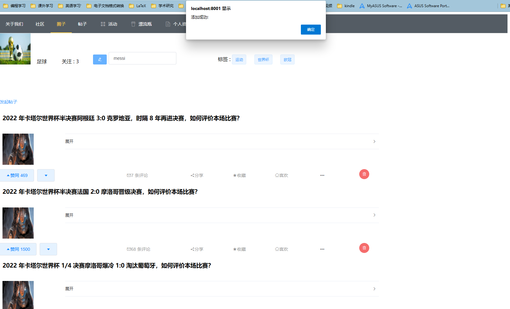
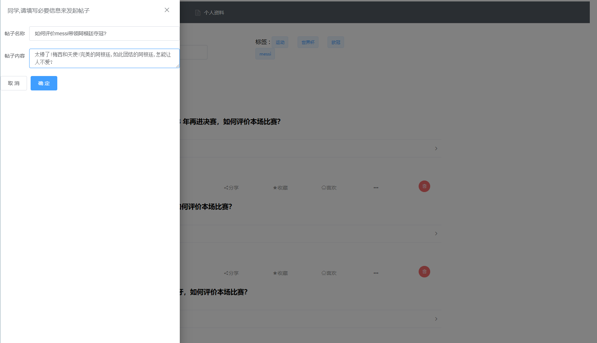

## 一. 系统结构设计

### 1.环境与框架

#### 1.1 前端

|    Web 框架    |   Vue.js   | 2.6.11  |
| :------------: | :--------: | :-----: |
|    开发工具    |  Vue-cli   | 4.5.15  |
|    Js解释器    |  node.js   | 16.14.0 |
| 软件包管理工具 |    npm     |  8.3.1  |
|   网络请求库   |   axios    | 0.27.2  |
|     美化库     | element-ui | 2.15.10 |
| Vue.js状态管理 |    vuex    |  3.4.0  |

#### 1.2 后端及数据库

后端使用python作为开发语言，使用Django框架进行后端开发。

| 项目           | 名称                 | 版本         |
| -------------- | -------------------- | ------------ |
| 解释器         | python               | >=3.8        |
| 后端框架       | django               | 4.1.4        |
| 后端数据库接口 | pymysql              |              |
| 前后端交互     | restframework        |              |
| 数据库管理系统 | mysql                | 8.0.3        |
| 头像风格迁移   | animegan2（pytorch） | torch>=1.7.1 |

### 2.体系结构

本系统采用前后端以及数据库分离的体系结构。前端基础页面为静态资源，通过与用户交互向后端发送修改数据请求，并获取修改结果；后端接受前端请求，根据请求对数据库进行增删改查，并返回请求结果至前端；数据库存储并管理数据。具体结构如下：

#### 2.1 前端

- 前端静态页面选择由HTML+CSS+JavaScript组成。HTML搭建文档的结构，创建页面的骨架；CSS用于设置文档的呈现效果，控制页面的样式；JavaScrip实现文档的行为，控制页面的行为。
- 前端主体框架为vue.js，由vue-cli脚手架搭建完成，方便实现复杂页面。
- 前端内部数据的存储使用vuex实现，用户登录后前端保有其登录信息，保证后续操作限制在登录信息的条件下。
- 前端页面还使用element-ui库进行页面优化。

#### 2.2 前后端交互

- 前后端合并时，采用axios进行对接，通过GET、POST请求实现前后端交互。

#### 2.3 后端

- 后端总体分为两部分：
  - view模块：实现所有对前端请求的处理与响应，接收前端数据并返回数据给前端。
  - mysql模块：实现所有与数据库的交互。从数据库检索数据或更新数据到数据库。

## 二. 系统功能结构图


## 三. 基本表定义

### 实体表

#### 用户（user）

| 字段名称      | 数据类型 | 字段大小 | 必填字段 | 主键 | 外键 | 说明                       |
| ------------- | -------- | -------- | -------- | ---- | ---- | -------------------------- |
| user_id       | int      | 20       | 是       | 是   | 否   | 自增主键                   |
| name          | varchar  | 255      | 是       | 否   | 否   | 用户名,唯一                |
| password      | varchar  | 255      | 是       | 否   | 否   | 密码                       |
| head_portrait | varchar  | 255      | 否       | 否   | 否   | 存放头像在文件系统中的路径 |
| contact       | varchar  | 255      | 否       | 否   | 否   | 联系方式                   |
| gender        | varchar  | 255      | 否       | 否   | 否   | 性别                       |
| age           | int      | 20       | 否       | 否   | 否   | 年龄                       |
| address       | varchar  | 255      | 否       | 否   | 否   | 地址                       |

#### 圈子（group）

| 字段名称   | 数据类型 | 字段大小 | 必填字段 | 主键 | 外键 | 说明         |
| ---------- | -------- | -------- | -------- | ---- | ---- | ------------ |
| group_id   | int      | 20       | 是       | 是   | 否   | 自增主键     |
| post_num   | int      | 20       | 是       | 否   | 否   | 帖子个数     |
| group_name | varchar  | 255      | 是       | 否   | 否   | 圈子名       |
| group_desc | varchar  | 1000     | 是       | 否   | 否   | 圈子描述     |
| user_id    | int      | 20       | 是       | 否   | 是   | 发起用户的id |

#### 帖子（post）

| 字段名称    | 数据类型 | 字段大小 | 必填字段 | 主键 | 外键 | 说明       |
| ----------- | -------- | -------- | -------- | ---- | ---- | ---------- |
| post_id     | int      | 20       | 是       | 是   | 否   | 自增主键   |
| name        | varchar  | 255      | 是       | 否   | 否   | 帖子名     |
| content     | varchar  | 10000    | 是       | 否   | 否   | 帖子内容   |
| post_time   | varchar  | 255      | 是       | 否   | 否   | 发帖时间   |
| comment_num | int      | 20       | 是       | 否   | 否   | 评论个数   |
| likes_num   | int      | 20       | 是       | 否   | 否   | 赞个数     |
| user_id     | int      | 20       | 是       | 否   | 是   | 发贴用户id |
| group_id    | int      | 20       | 是       | 否   | 是   | 所属圈子id |

#### 评论（comment）

| 字段名称     | 数据类型 | 字段大小 | 必填字段 | 主键 | 外键 | 说明             |
| ------------ | -------- | -------- | -------- | ---- | ---- | ---------------- |
| comment_id   | int      | 20       | 是       | 是   | 否   | 自增主键         |
| content      | varchar  | 10000    | 是       | 否   | 否   | 评论内容         |
| comment_time | varchar  | 255      | 是       | 否   | 否   | 评论时间         |
| likes_num    | int      | 20       | 是       | 否   | 否   | 赞个数           |
| user_id      | int      | 20       | 是       | 否   | 是   | 发表评论的用户id |
| post_id      | int      | 20       | 是       | 否   | 是   | 所属帖子id       |

#### 漂流瓶（bottle）

| 字段名称  | 数据类型 | 字段大小 | 必填字段 | 主键 | 外键 | 说明       |
| --------- | -------- | -------- | -------- | ---- | ---- | ---------- |
| bottle_id | int      | 20       | 是       | 是   | 否   | 自增主键   |
| content   | varchar  | 10000    | 是       | 否   | 否   | 漂流瓶内容 |
| user_id   | int      | 20       | 是       | 否   | 是   | 发送者id   |

#### 漂流瓶回复（bottle_reply）

| 字段名称        | 数据类型 | 字段大小 | 必填字段 | 主键 | 外键 | 说明             |
| --------------- | -------- | -------- | -------- | ---- | ---- | ---------------- |
| bottle_reply_id | int      | 20       | 是       | 是   | 否   | 自增主键         |
| reply           | varchar  | 10000    | 是       | 否   | 否   | 回复内容         |
| user_id         | int      | 20       | 是       | 否   | 是   | 发起回复的用户id |
| bottle_id       | int      | 20       | 是       | 否   | 是   | 回复给的漂流瓶id |

#### 活动（activity）

| 字段名称        | 数据类型 | 字段大小 | 必填字段 | 主键 | 外键 | 说明         |
| --------------- | -------- | -------- | -------- | ---- | ---- | ------------ |
| activity_id     | int      | 20       | 是       | 是   | 否   | 自增主键     |
| name            | varchar  | 255      | 是       | 否   | 否   | 活动名       |
| summary         | varchar  | 1000     | 是       | 否   | 否   | 活动概述     |
| begin_time      | varchar  | 255      | 是       | 否   | 否   | 活动开始时间 |
| end_time        | varchar  | 255      | 是       | 否   | 否   | 活动结束时间 |
| location        | varchar  | 255      | 是       | 否   | 否   | 活动地点     |
| activity_nature | varchar  | 255      | 是       | 否   | 否   | 活动性质     |
| user_id         | int      | 20       | 是       | 否   | 是   | 发起者id     |

#### 用户-圈子-打分表（user_group_score）

| 字段名称 | 数据类型 | 字段大小 | 必填字段 | 主键 | 外键 | 说明             |
| -------- | -------- | -------- | -------- | ---- | ---- | ---------------- |
| user_id  | int      | 20       | 是       | 是   | 是   | 用户id           |
| group_id | int      | 20       | 是       | 是   | 是   | 圈子id           |
| score    | int      | 20       | 是       | 否   | 否   | 用户对圈子的打分 |

#### 兴趣标签（tag）

| 字段名称 | 数据类型 | 字段大小 | 必填字段 | 主键 | 外键 | 说明     |
| -------- | -------- | -------- | -------- | ---- | ---- | -------- |
| tag_id   | int      | 20       | 是       | 是   | 否   | 自增主键 |
| tag_name | varchar  | 255      | 是       | 否   | 否   | 标签名   |

### 联系表

#### 用户点赞评论（user_like_comment）

| 字段名称   | 数据类型 | 字段大小 | 必填字段 | 主键 | 外键 | 说明         |
| ---------- | -------- | -------- | -------- | ---- | ---- | ------------ |
| user_id    | int      | 20       | 是       | 是   | 是   | 点赞用户id   |
| comment_id | int      | 20       | 是       | 是   | 是   | 被点赞评论id |

#### 用户点赞帖子（user_like_post）

| 字段名称 | 数据类型 | 字段大小 | 必填字段 | 主键 | 外键 | 说明         |
| -------- | -------- | -------- | -------- | ---- | ---- | ------------ |
| user_id  | int      | 20       | 是       | 是   | 是   | 点赞用户id   |
| post_id  | int      | 20       | 是       | 是   | 是   | 被点赞帖子id |

#### 用户具有的兴趣标签（user_tag）

| 字段名称 | 数据类型 | 字段大小 | 必填字段 | 主键 | 外键 | 说明   |
| -------- | -------- | -------- | -------- | ---- | ---- | ------ |
| user_id  | int      | 20       | 是       | 是   | 是   | 用户id |
| tag_id   | int      | 20       | 是       | 是   | 是   | 标签id |

#### 圈子具有的兴趣标签（group_tag）

| 字段名称 | 数据类型 | 字段大小 | 必填字段 | 主键 | 外键 | 说明   |
| -------- | -------- | -------- | -------- | ---- | ---- | ------ |
| group_id | int      | 20       | 是       | 是   | 是   | 圈子id |
| tag_id   | int      | 20       | 是       | 是   | 是   | 标签id |

#### 用户好友关系（user_user）

| 字段名称 | 数据类型 | 字段大小 | 必填字段 | 主键 | 外键 | 说明   |
| -------- | -------- | -------- | -------- | ---- | ---- | ------ |
| user1_id | int      | 20       | 是       | 是   | 是   | 用户id |
| user2_id | int      | 20       | 是       | 是   | 是   | 用户id |

#### 用户参与活动（user_activity）

| 字段名称    | 数据类型 | 字段大小 | 必填字段 | 主键 | 外键 | 说明   |
| ----------- | -------- | -------- | -------- | ---- | ---- | ------ |
| user_id     | int      | 20       | 是       | 是   | 是   | 用户id |
| activity_id | int      | 20       | 是       | 是   | 是   | 活动id |

#### 用户头像（user_profile_pic）

| 字段名称 | 数据类型 | 字段大小 | 必填字段 | 主键 | 外键 | 说明                       |
| -------- | -------- | -------- | -------- | ---- | ---- | -------------------------- |
| pic_id   | int      | 20       | 是       | 是   | 否   | 自增主键                   |
| user_id  | int      | 20       | 是       | 否   | 是   | 用户id                     |
| pic_path | varchar  | 255      | 是       | 否   | 否   | 图片在文件系统中存放的路径 |

### 建立数据库脚本

```sql
-- 使用分号作为结束符
delimiter ;
-- 如果存在数据库就先删除
DROP DATABASE buaa_db2;
CREATE DATABASE if not exists buaa_db2 DEFAULT CHARACTER SET utf8 COLLATE utf8_general_ci;
USE buaa_db2;

-- 删除表
DROP TABLE IF EXISTS `user`;
DROP TABLE IF EXISTS `group`;
DROP TABLE IF EXISTS `post`;
DROP TABLE IF EXISTS `comment`;
DROP TABLE IF EXISTS `bottle`;
DROP TABLE IF EXISTS `bottle_reply`;
DROP TABLE IF EXISTS `activity`;
DROP TABLE IF EXISTS `message`;
DROP TABLE IF EXISTS `tag`;
DROP TABLE IF EXISTS `user_like_comment`;
DROP TABLE IF EXISTS `user_like_post`;
DROP TABLE IF EXISTS `user_tag`;
DROP TABLE IF EXISTS `group_tag`;
DROP TABLE IF EXISTS `user_user`;
DROP TABLE IF EXISTS `user_activity`;
DROP TABLE IF EXISTS `user_profile_pic`;

-- init table
-- 新建user表，user_id是自增主键
CREATE TABLE `user`
(
  `user_id`       INT(20)       NOT NULL AUTO_INCREMENT PRIMARY KEY ,
  `name`          VARCHAR(255)  NOT NULL UNIQUE ,
  `password`      VARCHAR(255)  NOT NULL ,
  `head_portrait` VARCHAR(255) ,
  `contact`       VARCHAR(255) ,
  `gender`        VARCHAR(255) ,
  `age`           INT(20) ,
  `address`       VARCHAR(255)

)ENGINE=InnoDB DEFAULT CHARSET=utf8;

-- 新建group表，其中user_id是外键，group_id是自增主键。
CREATE TABLE `group`
(
  `group_id`          INT(20)       NOT NULL AUTO_INCREMENT PRIMARY KEY ,
  `post_num`          INT(20)       NOT NULL ,
  `group_name`        VARCHAR(255)  NOT NULL ,
  `group_desc`        VARCHAR(1000) NOT NULL ,
  `user_id`           INT(20)       NOT NULL ,
  FOREIGN KEY(`user_id`) REFERENCES `user`(`user_id`)

)ENGINE=InnoDB DEFAULT CHARSET=utf8;
-- 新建post表，post_id是自增主键，user_id，group_id是外键
CREATE TABLE `post`
(
  `post_id`     INT(20)         NOT NULL AUTO_INCREMENT PRIMARY KEY ,
  `name`        VARCHAR(255)    NOT NULL ,
  `content`     VARCHAR(10000)  NOT NULL ,
  `post_time`   VARCHAR(255)    NOT NULL ,
  `comment_num` INT(20)         NOT NULL ,
  `likes_num`   INT(20)         NOT NULL ,
  `user_id`     INT(20)         NOT NULL ,
  `group_id`    INT(20)         NOT NULL ,
  FOREIGN KEY(`user_id`) REFERENCES `user`(`user_id`) ,
  FOREIGN KEY(`group_id`) REFERENCES `group`(`group_id`)

)ENGINE=InnoDB DEFAULT CHARSET=utf8;
-- 新建评论表，comment_id是自增主键，user_id，post_id是外键
CREATE TABLE `comment`
(
  `comment_id`    INT(20)         NOT NULL AUTO_INCREMENT PRIMARY KEY ,
  `content`       VARCHAR(10000)  NOT NULL ,
  `comment_time`  VARCHAR(255)    NOT NULL ,
  `likes_num`     INT(20)         NOT NULL ,
  `user_id`       INT(20)         NOT NULL ,
  `post_id`       INT(20)         NOT NULL ,
  FOREIGN KEY(`user_id`) REFERENCES `user`(`user_id`) ,
  FOREIGN KEY(`post_id`) REFERENCES `post`(`post_id`)

)ENGINE=InnoDB DEFAULT CHARSET=utf8;
-- 新建bottle表，bottle_id是自增主键，user_id是外键
CREATE TABLE `bottle`
(
  `bottle_id` INT(20)         NOT NULL AUTO_INCREMENT PRIMARY KEY ,
  `content`   VARCHAR(10000)  NOT NULL ,
  `user_id`   INT(20)         NOT NULL ,
  FOREIGN KEY(`user_id`) REFERENCES `user`(`user_id`) 

)ENGINE=InnoDB DEFAULT CHARSET=utf8;
-- 新建bottle_reply表，bottle_reply_id是自增主键，
-- user_id，bottle_id是外键
CREATE TABLE `bottle_reply`
(
  `bottle_reply_id` INT(20)         NOT NULL AUTO_INCREMENT PRIMARY KEY ,
  `reply`           VARCHAR(10000)  NOT NULL ,
  `user_id`         INT(20)         NOT NULL ,
  `bottle_id`       INT(20)         NOT NULL ,
  FOREIGN KEY(`user_id`) REFERENCES `user`(`user_id`) ,
  FOREIGN KEY(`bottle_id`) REFERENCES `bottle`(`bottle_id`)

)ENGINE=InnoDB DEFAULT CHARSET=utf8;
-- 新建activity表,activity_id是自增主键,user_id是外键.
CREATE TABLE `activity`
(
  `activity_id` INT(20)         NOT NULL AUTO_INCREMENT PRIMARY KEY ,
  `name`        VARCHAR(255)    NOT NULL ,
  `summary`     VARCHAR(1000)   NOT NULL ,
  `begin_time`  VARCHAR(255)    NOT NULL ,
  `end_time`    VARCHAR(255)    NOT NULL ,
  `location`    VARCHAR(255)    NOT NULL ,
  `activity_nature` VARCHAR(255) NOT NULL, 
  `user_id`     INT(20)         NOT NULL ,
  FOREIGN KEY(`user_id`) REFERENCES `user`(`user_id`) 

)ENGINE=InnoDB DEFAULT CHARSET=utf8; 

CREATE TABLE  `message`
(   
  `message_id`  INT(20)         NOT NULL AUTO_INCREMENT PRIMARY KEY ,
  `content`     VARCHAR(10000)  NOT NULL ,
  `send_time`   VARCHAR(255)    NOT NULL ,
  `send_id`     INT(20)         NOT NULL ,
  `receive_id`  INT(20)         NOT NULL ,
  FOREIGN KEY(`send_id`) REFERENCES `user`(`user_id`) ,
  FOREIGN KEY(`receive_id`) REFERENCES `user`(`user_id`) 

)ENGINE=InnoDB DEFAULT CHARSET=utf8; 

CREATE TABLE  `tag`
(
  `tag_id`    INT(20)       NOT NULL AUTO_INCREMENT PRIMARY KEY ,
  `tag_name`  VARCHAR(255)  NOT NULL 

)ENGINE=InnoDB DEFAULT CHARSET=utf8; 

CREATE TABLE  `user_like_comment`
(
  `user_id`     INT(20)       NOT NULL,
  `comment_id`  INT(20)       NOT NULL,
  FOREIGN KEY(`user_id`) REFERENCES `user`(`user_id`) ,
  FOREIGN KEY(`comment_id`) REFERENCES `comment`(`comment_id`) ,
  PRIMARY KEY(`user_id`, `comment_id`)
)ENGINE=InnoDB DEFAULT CHARSET=utf8; 

CREATE TABLE  `user_like_post`
(
  `user_id` INT(20)       NOT NULL , 
  `post_id` INT(20)       NOT NULL , 
  FOREIGN KEY(`user_id`) REFERENCES `user`(`user_id`) ,
  FOREIGN KEY(`post_id`) REFERENCES `post`(`post_id`) ,
  PRIMARY KEY(`user_id`, `post_id`)
)ENGINE=InnoDB DEFAULT CHARSET=utf8; 

CREATE TABLE  `user_tag`
(
  `user_id`   INT(20)       NOT NULL ,  
  `tag_id`  INT(20)       NOT NULL , 
  FOREIGN KEY(`user_id`) REFERENCES `user`(`user_id`) ,
  FOREIGN KEY(`tag_id`) REFERENCES `tag`(`tag_id`) ,
  PRIMARY KEY(`user_id`, `tag_id`)
)ENGINE=InnoDB DEFAULT CHARSET=utf8; 

CREATE TABLE  `group_tag`
(
  `group_id`  INT(20)       NOT NULL ,
  `tag_id`  INT(20)       NOT NULL ,
  FOREIGN KEY(`group_id`) REFERENCES `group`(`group_id`) ,
  FOREIGN KEY(`tag_id`) REFERENCES `tag`(`tag_id`) ,
  PRIMARY KEY(`group_id`, `tag_id`)

)ENGINE=InnoDB DEFAULT CHARSET=utf8; 

CREATE TABLE  `user_user`
(
  `user1_id` INT(20)       NOT NULL ,
  `user2_id` INT(20)       NOT NULL ,
  FOREIGN KEY(`user1_id`) REFERENCES `user`(`user_id`) ,
  FOREIGN KEY(`user2_id`) REFERENCES `user`(`user_id`) ,
  PRIMARY KEY(`user1_id`, `user2_id`)

)ENGINE=InnoDB DEFAULT CHARSET=utf8; 

CREATE TABLE  `user_acitivity`
(
  `user_id`     INT(20)       NOT NULL ,
  `activity_id` INT(20)       NOT NULL ,
  FOREIGN KEY(`user_id`) REFERENCES `user`(`user_id`) ,
  FOREIGN KEY(`activity_id`) REFERENCES `activity`(`activity_id`) ,
  PRIMARY KEY(`user_id`, `activity_id`)
)ENGINE=InnoDB DEFAULT CHARSET=utf8; 

CREATE TABLE `user_profile_pic`
(
  `pic_id`    INT(20)       NOT NULL AUTO_INCREMENT PRIMARY KEY ,
  `user_id`   INT(20)       NOT NULL UNIQUE ,
  `pic_path`  VARCHAR(255)  NOT NULL,
  FOREIGN KEY(`user_id`) REFERENCES `user`(`user_id`) 
)ENGINE=InnoDB DEFAULT CHARSET=utf8; 

CREATE TABLE `user_group_score`
(
  `user_id`     INT(20)   NOT NULL ,
  `group_id`  INT(20)     NOT NULL ,
  `score`     INT(20)     NOT NULL ,  
  FOREIGN KEY(`user_id`) REFERENCES `user`(`user_id`) ,
  FOREIGN KEY(`group_id`) REFERENCES `group`(`group_id`)
)ENGINE=InnoDB DEFAULT CHARSET=utf8; 
```


## 四. 系统重要功能实现

### 使用animegan2进行用户头像风格迁移

为了符合makefun社交平台的特点，增加趣味性与用户体验感，我们为用户头像使用animegan2网络进行风格迁移，变为动漫风格头像后存储并展示。

将现实世界场景的照片转换为动漫风格的图像，在计算机视觉和艺术风格迁移方面是一项有意义且具有挑战性的任务。 AnimeGANv2通过简单地改变网络中特征的归一化来防止高频伪影的产生。此外，它相比AnimeGAN进一步缩小了生成器网络的规模，以实现更高效的动画风格迁移。、

在后端views模块用户上传头像函数中，接收到图片后会调用animegan2函数进行动漫风格迁移，并将处理完的图片存储进本地文件夹中。


```python
class uploadUserProfilePic(APIView):
  def post(self, request):
    pic = request.FILES.get('pic', None)
    userId = request.POST.get('userId', None)
    save_dir = '%s'%(MEDIA_ROOT)
    image_name = '%s.jpg'%(userId)
    save_path = '%s\\%s.jpg'%(MEDIA_ROOT, userId)
    sql_save_path = 'media/%s.jpg'%(userId)
    with open(save_path, 'wb') as f:
      for content in pic.chunks():
        f.write(content)
    sql = Mysql()
    result = sql.addUserProfilePic(userId, str(sql_save_path))
    # animegan2
    print("run animegan2")
    animegan2(input_dir=save_dir, output_dir=save_dir, image_name=image_name)
    return Response({'status' : result})
```

在源代码animegan2/weights文件夹中，可以选择不同的模型参数，以得到不同的风格迁移效果，目前有四种参数：

- celeba_distill
- face_paint_512_v1
- face_paint_512_v2
- paprika

#### 效果展示：

具体操作方法请看系统功能实现部分。


### 推荐系统

#### 给用户推荐圈子：使用基于用户的协同过滤推荐（UserCF）

协同过滤（Collaborative Filtering）推荐算法是最经典，最常用的推荐算法，基于用户的协同过滤是基于这样的假设：为特定用户找到他真正感兴趣的内容的好方法是首先找到与此用户有相似兴趣的其他用户，然后将他们感兴趣的内容推荐给此用户。

对于一个圈子，我们认为用户在该圈子中的发帖数与评论数越多，那么该用户对这个圈子更感兴趣。定义某个用户对某个圈子的感兴趣程度（打分）：

- 用户在圈子中发帖，则该用户对该圈子感兴趣程度增加 5
- 用户在圈子中的某个帖子中评论，则该用户对该圈子感兴趣程度增加 3
- 用户对圈子中的某个帖子或者评论点赞，则该用户对该圈子感兴趣程度增加 1

如此以来，我们就得到了一张用户——圈子打分表。表格里是所有用户对所有圈子的感兴趣程度：

| 用户/圈子 | 圈子1 | 圈子2 | ............ | 圈子n |
| --------- | ----- | ----- | ------------ | ----- |
| Alice     | 10    | 12    |              | 0     |
| 用户2     | 3     | 4     |              | 3     |
| 用户3     | 3     | 6     |              | 5     |
| 用户4     | 6     | 3     |              | 1     |
|           |       |       |              |       |

注意到有些用户如例子中的Alice对圈子n的打分是0，我们认为这代表着Alice还没有浏览到该圈子，而推荐系统的作用就是推测Alice对这个圈子的打分。推荐算法的步骤如下：

- 首先，根据前面的这些打分情况（或者说已有的用户向量）计算一下Alice和用户2,3,4的相似程度，找出与Alice最相似的n个用户。
- 根据这n个用户对圈子n的评分情况和与Alice的相似程度，猜测出Alice对圈子n的打分。在后端返回给前端的圈子列表中，打分越高的圈子会越靠前。

##### 具体过程

- 1.计算用户之间相似度，使用余弦相似度得出两个用户之间的相似度：
  - $u$ 和 $v$ 分别是两个用户对圈子的打分向量。

$$
sim_{uv} = cos(u,v) =\frac{u\cdot v}{|u|\cdot |v|}
$$

- 2.计算用户对圈子的打分预测：
  - 利用目标用户与相似用户之间的相似度以及相似用户对该圈子的评分，来预测目标用户对该圈子的打分估计：
  - 其中，权重 $w_{u,s}$ 是用户 $u$ 和用户 $s$ 的相似度， $R_{s,p}$ 是用户 $s$ 对圈子 $p$ 的评分。

$$
R_{\mathrm{u}, \mathrm{p}}=\frac{\sum_{\mathrm{s} \in S}\left(w_{\mathrm{u}, \mathrm{s}} \cdot R_{\mathrm{s}, \mathrm{p}}\right)}{\sum_{\mathrm{s} \in S} w_{\mathrm{u}, \mathrm{s}}}
$$


- 3.在使用推荐算法补全用户对圈子的打分后，按照打分从高到低的顺序返回圈子给前端。


##### 具体实现

数据库中增加一张用户-圈子-打分表：

```sql
CREATE TABLE `user_group_score`
(
  `user_id`     INT(20)   NOT NULL ,
  `group_id`  INT(20)     NOT NULL ,
  `score`     INT(20)     NOT NULL ,  
  FOREIGN KEY(`user_id`) REFERENCES `user`(`user_id`) ,
  FOREIGN KEY(`group_id`) REFERENCES `group`(`group_id`)
)ENGINE=InnoDB DEFAULT CHARSET=utf8; 
```

增加触发器与存储过程，当用户发表帖子，评论，或者点赞时，相应触发器调用存储过程， 更新用户-圈子-打分表：

```sql
-- 更新user_group_score表的存储过程，如果表中没有对应的userid和groupid的表项，就新建一个表项，否则在原有表项基础上增加
delimiter $$
create procedure `update_user_group_score` (in `userid` INT(20), in `groupid` INT(20), in `add_score` INT(20) )
begin
  if (not exists (select * from `user_group_score` where `user_id`=`userid` and `group_id`=`groupid`)) then
    insert into `user_group_score`(`user_id`,`group_id`,`score`) values (`userid`, `groupid`, `add_score`);
  else
    update `user_group_score` set `score`=`score` + `add_score` where `user_id`=`userid` and `group_id`=`groupid`;
  end if;
end$$
delimiter ;
-- 插入post表后该触发器运行，更新用户-圈子-打分表中对应用户与圈子的表项+5
delimiter $$
create trigger `update_score_after_user_add_post` after insert on `post` for each ROW
begin
  CALL `update_user_group_score`(new.user_id, new.group_id, 5);
end$$
delimiter ;
-- 插入comment表后该触发器运行，更新用户-圈子-打分表中对应用户与圈子的表项+3
delimiter $$
create trigger `update_score_after_user_add_comment` after insert on `comment` for each ROW
begin
  select `group_id` into @groupid from `post` where `post`.`post_id`=new.post_id;
  CALL `update_user_group_score`(new.user_id, @groupid, 3);
end$$
delimiter ;
-- 插入user_like_post表后该触发器运行，更新用户-圈子-打分表中对应用户与圈子的表项+1
delimiter $$
create trigger `update_score_after_user_like_post` after insert on `user_like_post` for each ROW
begin
  select `group_id` into @groupid from `post` where `post`.`post_id`=new.post_id;
  CALL `update_user_group_score`(new.user_id, @groupid, 1);
end$$
delimiter ;
-- 插入user_like_comment表后该触发器运行，更新用户-圈子-打分表中对应用户与圈子的表项+1
delimiter $$
create trigger `update_score_after_user_like_comment` after insert on `user_like_comment` for each ROW
begin
  select `group_id` into @groupid from `post` where `post`.`post_id`=(select post_id from comment where comment.comment_id=new.comment_id);
  CALL `update_user_group_score`(new.user_id, @groupid, 1);
end$$
delimiter ;
```

当用户获取圈子时，按照用户-圈子-打分表中的值计算用户相似度与圈子推荐程度，计算用户-圈子-打分表中该用户没有的表项的圈子的打分，返回圈子列表。

## 五. 触发器与存储过程的设计与实现说明

在我们的设计中，触发器的作用主要是用来更新表中的关联信息，以及删除级联关系。

### 更新关联信息触发器

- 对象：group
- 触发条件：当向post表中增加或者删除条目时会触发，若删除一个post，则对应group中post_num会减一，否则加一。

```sql
-- trigger
create trigger `inc_post_num_in_group` after insert on `post` for each row
  update `group` set `post_num`=`post_num` + 1 where `group`.`group_id`=new.`group_id`;

create trigger `dec_post_num_in_group` before delete on `post` for each row
  update `group` set `post_num`=`post_num` - 1 where `group`.`group_id`=old.`group_id`;
```

- 对象：post
- 触发条件：当向comment表中增加或者删除条目时会触发，若删除一个comment，则对应post中comment_num会减一，否则加一。

```sql
create trigger `inc_comment_num_in_post` after insert on `comment` for each row
  update `post` set `comment_num`=`comment_num` + 1 where `post`.`post_id`=new.`post_id`;

create trigger `dec_comment_num_in_post` after delete on `comment` for each row
  update `post` set `comment_num`=`comment_num` - 1 where `post`.`post_id`=old.`post_id`;
```

- 对象：post
- 触发条件：当插入或删除user_like_post表时，对应的post条目中likes_num会加一或减一。

```sql
create trigger `inc_likes_num_in_post` after insert on `user_like_post` for each row
  update `post` set `likes_num`=`likes_num` + 1 where `post`.`post_id`=new.`post_id`;

create trigger `dec_likes_num_in_post` after delete on `user_like_post` for each row
  update `post` set `likes_num`=`likes_num` - 1 where `post`.`post_id`=old.`post_id`;
```

- 对象：comment
- 触发条件：当插入或删除user_like_comment表时，对应的post条目中likes_num会加一或减一。

```sql
create trigger `inc_likes_num_in_comment` after insert on `user_like_comment` for each row
  update `comment` set `likes_num`=`likes_num` + 1 where `comment`.`comment_id`=new.`comment_id`;

create trigger `dec_likes_num_in_comment` after delete on `user_like_comment` for each row
  update `comment` set `likes_num`=`likes_num` - 1 where `comment`.`comment_id`=old.`comment_id`;
```

- 对象：user_group_score
- 触发条件：当向post中插入数据时，调用对应存储过程 update_user_group_score 更新 user_group_score 中对应项分数 + 5

```sql
delimiter $$
create trigger `update_score_after_user_add_post` after insert on `post` for each ROW
begin
  CALL `update_user_group_score`(new.user_id, new.group_id, 5);
end$$
delimiter ;
```

- 对象：user_group_score
- 触发条件：当向comment中插入数据时，调用对应存储过程 update_user_group_score 更新 user_group_score 中对应项分数 + 3

```sql
delimiter $$
create trigger `update_score_after_user_add_comment` after insert on `comment` for each ROW
begin
  select `group_id` into @groupid from `post` where `post`.`post_id`=new.post_id;
  CALL `update_user_group_score`(new.user_id, @groupid, 3);
end$$
delimiter ;
```

- 对象：user_group_score
- 触发条件：当向user_like_comment或者user_like_post中插入数据时，调用对应存储过程 update_user_group_score 更新 user_group_score 中对应项分数 + 1

```sql
-- 插入user_like_post表后该触发器运行，更新用户-圈子-打分表中对应用户与圈子的表项+1
delimiter $$
create trigger `update_score_after_user_like_post` after insert on `user_like_post` for each ROW
begin
  select `group_id` into @groupid from `post` where `post`.`post_id`=new.post_id;
  CALL `update_user_group_score`(new.user_id, @groupid, 1);
end$$
delimiter ;
-- 插入user_like_comment表后该触发器运行，更新用户-圈子-打分表中对应用户与圈子的表项+1
delimiter $$
create trigger `update_score_after_user_like_comment` after insert on `user_like_comment` for each ROW
begin
  select `group_id` into @groupid from `post` where `post`.`post_id`=(select post_id from comment where comment.comment_id=new.comment_id);
  CALL `update_user_group_score`(new.user_id, @groupid, 1);
end$$
delimiter ;
```

### 删除级联关系触发器

- 对象：post，group_tag
- 触发条件：对group表做删除操作时，删除对应group中的所有post,以及该group拥有的所有tag

```sql
create trigger `delete_post_in_group_before_delete_group` before delete on `group` for each row
  delete from `post` where `group_id`=old.`group_id`;

create trigger `delete_group_tag_before_delete_group` before delete on `group` for each row
  delete from `group_tag` where `group_id`=old.`group_id`;
```

- 对象：comment，user_like_post
- 触发条件：对post表做删除操作时，删除对应post中的所有comment,以及该post拥有的所有likes

```sql
create trigger `delete_comment_in_post_before_delete_post` before delete on `post` for each row
  delete from `comment` where `post_id`=old.`post_id`;

create trigger `delete_user_like_post_before_delete_post` before delete on `post` for each row
  delete from `user_like_post` where `post_id`=old.`post_id`;
```

- 对象：user_like_comment
- 触发条件：对comment表做删除操作时，删除该comment拥有的所有likes

```sql
create trigger `delete_user_like_comment_before_delete_comment` before delete on `comment` for each row
  delete from `user_like_comment` where `comment_id`=old.`comment_id`;
```

### 添加tag时的存储过程

- 过程输入：tag名字
- 过程输出：无
- 作用：检查tag表中是否存在输入的tagName，若无就创建一个条目。避免冗余信息。

```sql
delimiter $$
create procedure `checkAndAddTagProc` (in `tagName` VARCHAR(255))
begin
  if (not exists (select * from `tag` where `tag_name`=`tagName`)) then
    insert into `tag` (tag_name) values (`tagName`);
  end if;
end$$
delimiter ;
```

### 更新用户-圈子打分表所用存储过程

- 过程输入：用户id，圈子id，要增加的分数
- 过程输出：无
- 作用：如果user_group_score表中没有对应的userid和groupid的表项，就新建一个表项，然后在原有表项基础上增加要增加的分数

```sql
-- 更新user_group_score表的存储过程，如果表中没有对应的userid和groupid的表项，就新建一个表项，否则在原有表项基础上增加
delimiter $$
create procedure `update_user_group_score` (in `userid` INT(20), in `groupid` INT(20), in `add_score` INT(20) )
begin
  if (not exists (select * from `user_group_score` where `user_id`=`userid` and `group_id`=`groupid`)) then
    insert into `user_group_score`(`user_id`,`group_id`,`score`) values (`userid`, `groupid`, `add_score`);
  else
    update `user_group_score` set `score`=`score` + `add_score` where `user_id`=`userid` and `group_id`=`groupid`;
  end if;
end$$
delimiter ;
```

## 五. 系统功能展示

### 主页面

这里简要介绍了本网站的主要目的以及功能。


在主页，如果鼠标往下滑，就会触发弹窗，点击进入登录注册页面


### 登录注册页面

上方有选项选择是登录还是注册，注册页面需要填写登记所需信息；如果不填完整信息，将无法进行注册。


登录页面，需要输入正确用户名和密码才能登录，否则会报错。登录成功会跳转到个人主页页面。


### 社区页面

这里展示了热门的圈子的图片，以及所有圈子的信息。


点击圈子的名字，可以跳转进入相应的圈子。在社区页面，用户可以添加圈子：


也可以删除自己创建的圈子（不能删除别人创建的）


### 圈子页面

这里包含本圈子的基本信息，以及包含的帖子和帖子的信息（内容，评论数等）。


在本页面，用户可以给当前圈子添加tag。



可以发起帖子。




用户也可以删除自己创建的帖子，但不能删除别人的帖子。


### 帖子页面

本页面展示了帖子的内容，以及所有评论内容；并展示了帖子的赞同数和评论的赞同数。


用户可以给帖子点赞


用户可以给帖子发表评论


用户可以给评论点赞


用户可以删除自己发表的评论，不能删除别人的评论。


### 个人资料页面

这里展示了用户的头像、用户ID、用户的个人信息（包括用户名、性别、年龄、联系方式、联系地址）


#### 修改头像

用户可以通过点击选择文件，选择自己喜欢的照片作为头像


选中后，点击确认添加，将新头像上传


我们还实现了将图片进行风格迁移，将原图像进行一定处理后生成用户头像，增强了网站的趣味性


#### 增删兴趣Tag

用户可以删减或自定义增加兴趣Tag

##### （1）删除已有Tag


##### （2）增加自定义Tag


#### 修改个人信息


提示修改成功


### 漂流瓶


该页面实现了MakeFun的特色功能

- 用户可以在这随机获取陌生用户发送的漂流瓶：
  - 若用户对漂流瓶内容（如图中的"你好呀"）感兴趣，可以点击**回复该漂流瓶**对漂流瓶进行回复；若不感兴趣，通过点击灰色按键**下一个**再次随机获取漂流瓶信息
- 用户可以在下方输入框中按照“请输入漂流瓶内容”提示，输入想发送的漂流瓶内容，然后点击**发送漂流瓶**发送漂流瓶。
- 中间的三个按键，分别问
  - 我发出的漂流瓶
  - 我收到的漂流瓶回复
    - 
    - 这里面是漂流瓶回复内容，若用户对回复赞同，就点击赞同
  - 我回复的漂流瓶

### 活动页面

这里**罗列展示**了目前已有的活动


用户也可以**自行创建**活动


该页面展示目前已有活动的详细信息，用户可以通过点击蓝色文字**创建活动**

显示**活动创建页面**如下


用户分别在对应框中分别填入**活动名称**


选择**活动区域**


选择**活动开始日期**和**活动结束日期**


选择**活动性质**


填写**活动描述**

最后点击**立即创建**按钮后，进一步点提示中的**确定**完成创建


显示**提交成功**提示


## 六. 收获与体会

#### **张爱玲**

这一次数据库大作业，通过团队三个人的思考，设计出了MakeFun网站，而我在这次任务中主要负责前端。

这是我第一次接触前端开发，我首先学会了html、css、javascript的相关知识，然后为了更方便的开发，学会了如何用Vue进行前端开发。此外也学习了使用Element-UI，从而能够基本地实现出自己所设想的页面。

在初次设计MakeFun网站时，我们首次体验了数据库逻辑设计的过程，我们需要将我们提交的需求报告转换为要实现的概念实体。于是我们抽象出了实体，并画出了E-R图，并相继根据网页要求设计了数据库表。这也让我体验了数据库设计的完整过程，虽然我们设计的比较简单，但是该过程也让我们收获了很多。

#### 郭鸿宇

在数据库大作业项目中，我主要负责后端开发。在开发时我遇到了很多困难，但都一个个解决了，最终掌握了很多新技能并极大地提升了自己，主要包括以下几点：

- 小组合作能力：根据我的经验，团队开发的关键在任务划分，接口定义和ddl管理。首先划分清楚任务，所有人才能知道自己要做什么，而划分任务需要基于对所做项目的理解。然后是接口定义，在这个大作业中，重点就是前后端交互api的定义，这部分花费了我们不少时间。最后是ddl管理，本次大作业我们提前计划，尽早开使，指定各个时间节点，基本没有赶工的现象发生。
- 对web体系结构的认识：数据库大作业让我对web体系结构有了初步了解，明确了各部分的作用以及交互方式，了解了前后端通信的基本方法。
- 后端开发能力：掌握了django的使用，以及通过pymysql写sql语句与数据库交互。通过应用熟练掌握了一些sql语句，领悟了触发器与存储过程的作用。
- 后端debug能力：使用postman模拟前端发送请求，后端通过print log与异常报告错误。

数据库确实是门好课，感谢老师、队友和助教的付出。

#### 赵良兵

经过一学期的努力,我们小组合作完成了一个属于当代大学生的虚拟匿名社交平台，称其为“makeFun社交平台”。在此次数据库大作业的项目开发中，我主要负责前端开发，期间收获良多：

- vue的使用能力。这就不得不提自学vue伊始的事情。一开始在b站搜教学视频学习的vue.js，感觉已经学会了；结果看项目教学视频上手都用的vue-cli，感觉跟之前所学对不上。捋了许久，才发觉vue.js是在vue-cli脚手架创建的项目中具体使用的语法。从这件事就能看出我在自学vue的路途上遭遇了多少挫折。但这些都促使我对vue有着越来越深的了解，以及越来越熟练的使用。
- debug能力。因为前端开发不同以往的编程，以往的编程打个断点，进入debug模式就能一步步运行，看每一步运行结果来判断哪儿写的有问题。前端开发只能用`console.log`打印到控制台，即其他编程的`print`debug法。这样情况使得debug十分困难，一旦有bug就会十分头疼。
- 小组合作能力。我们组有两位同学负责前端，一位同学负责后端。因此作为负责前端的，首先要和另一位同学拼接好得到完整前端，然后再与后端同学进行对接，完成前后端的合并。对接的过程会出现各种问题，不仅限于bug、进度等问题。但在这次大作业的过程中，我学会了友好、耐心的去处理这些问题，使得此次小组作业算是本科以来完成最和睦、作业完成度最高的一次。在此也感谢两位队友的努力与帮助。

最后感谢数据库这门课的大作业，让我不仅学习了数据库知识，还收获了前端开发经验，以及团队合作经历；感谢老师、助教、队友的付出，让我们能交出makeFun平台这份答卷。


