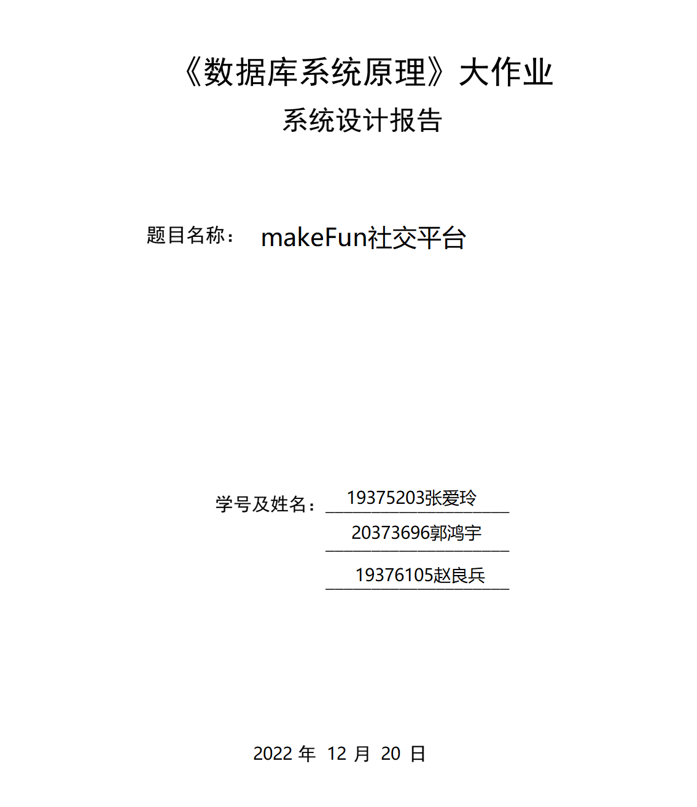

#### 组内同学承担任务说明

| 姓名 | 子任务1：系统功能设计与数据库设计 | 系统服务器端开发 | 系统客户端开发 | 工作量占比 |
| ---- | --------------------------------- | ---------------- | -------------- | ---------- |
|      |                                   |                  |                |            |
|      |                                   |                  |                |            |
|      |                                   |                  |                |            |


# 系统设计报告

## 一、需求分析

makeFun社交平台是基于部分匿名消息和兴趣图谱的属于当代大学生的虚拟社交平台。在makeFun中用户可以无顾虑的表达自己，认知他人，交流兴趣和观点，获得精神共鸣和认同感。在交流中获取信息，并获得有质量的新关系。在元宇宙带来的社交新浪潮下，makeFun展现真实，有趣，温暖的社交面貌，致力于满足当代大学生的精神需求。

同时，makeFun还相信大众的力量，多数人的判断，和数字的智慧。所有的内容，分类，筛选，排序都由每一个用户决定和产生。在makeFun的社区中，给评论一个赞，它的排位会自动上升。贴一个tag给一个圈子，它会在整个网站的标签分类中出现。

### 1.需求描述

#### 个人信息管理功能

用户需要在注册页面上注册才能浏览网站的全部信息。用户注册并登录后，可以在个人主页上传自己的头像，该**头像会自动迁移为漫画风格**。用户还可以在个人主页修改自己的联系方式，查看自己的**好友**，查看回复过的**漂流瓶**与抛出过的**漂流瓶**。参与的**活动**与关注的活动与创建的活动，以及选择自己的**偏好tag**。

#### 社区功能

在makeFun的社区板块中有一系列的圈子，圈子是一系列类似主题帖子的集合，类似于贴吧，但是圈子中发帖与评论均是**匿名的**，用户只能互相看到各自的头像。 用户可以在社区板块中发起圈子，在圈子中发表帖子，并在帖子中发表评论。还可以给帖子或者评论点赞。用户还可以**给圈子添加tag**。makeFun平台会根据帖子的发表时间，赞个数，评论数对圈子中的帖子进行综合排序；根据圈子中的帖子个数，圈子tag与用户tag的匹配度对圈子进行综合排序；根据评论的发表时间，评论的赞数对帖子中的评论进行综合排序并呈现给用户。

#### 漂流瓶功能

在makeFun的漂流瓶板块中，用户可以跟陌生人交朋友，接收，投放漂流瓶。漂流瓶板块主要分为两个部分：发送与接收模块。在发送模块中用户可以匿名发送一个问题或者随想，系统会将它随机发送给别的用户。在接收模块中，有一系列系统随机选择的其它用户发放的漂流瓶，可以选择回答该漂流瓶或者不回答。若用户回答了一个漂流瓶，则发送漂流瓶的用户会收到该条回答消息与是否关注的提示。若选择关注，则漂流瓶的发送用户与评论用户会出现在各自的好友列表中，各自可以看到互相的个人信息，并进行私聊。

#### 私聊功能

当两个用户成为好友后可以进行私聊。具体而言，需要在个人主页的好友列表中选择好友并发送消息。若收到好友发送的消息，则在主页上会产生消息提示。

#### 活动功能

在makeFun的活动板块中，用户可以发布活动并关注，参与活动。对于发布活动，需要填写活动标题，时间，地点，类型，活动须知与活动详情。对于已经发布的活动，用户可以选择**参加**或者**关注**，活动中会显示参加或者关注的用户的用户头像。当活动时间过后，活动会自动删除。

### 2.数据流图

##### 顶层数据流图


#### 登录注册页面


#### 个人主页


#### 活动页面


#### 社区页面


#### 圈子页面


#### 帖子页面


#### 漂流瓶页面


## 二、数据库概念模式设计

### 1.系统实体E-R图


### 2.系统联系E-R图


## 三、数据库逻辑模式设计

### 1.数据库关系模式

按照系统联系E-R图，我们为数据库创建了16种关系模式，每种关系模式都可以用五元组$R(U,D,Dom,F)$来表示。其中，$R$表示关系名，$U$表示组成该关系的属性名集合，$D$为$U$中属性所来自的域，$Dom$为属性向域的映像集合。对于数据库关系模式的设计而言，我们此处不讨论$D$和$Dom$，仅用三元组$R(U,F)$来描述我们设计的关系模式。

#### 1）user

- 关系名$R:user$
- 属性集合$U:$

| 属性名        | 含义                       |
| ------------- | -------------------------- |
| user_id       | 用户唯一标识               |
| name          | 用户名                     |
| password      | 用户账户密码               |
| head_portrait | 用户头像在文件系统中的路径 |
| contact       | 用户联系方式               |
| gender        | 用户性别                   |
| age           | 用户年龄                   |
| address       | 用户地址                   |

- 函数依赖集合$F$:
  - $user\_id \rightarrow name$
  - $user\_id \rightarrow password $
  - $user\_id \rightarrow head\_portrait$
  - $user\_id \rightarrow contact$
  - $user\_id \rightarrow gender$
  - $user\_id \rightarrow age$
  - $user\_id \rightarrow address$

#### 2）group

- 关系名$R:group$
- 属性集合$U:$

| 属性名     | 含义           |
| ---------- | -------------- |
| group_id   | 圈子的唯一标识 |
| post_num   | 包含帖子个数   |
| group_name | 圈子名         |
| group_desc | 圈子描述       |
| user_id    | 发起用户的id   |
| pic        | 圈子图像的路径 |

- 函数依赖集合$F:$
  - $group\_id \rightarrow post\_num$
  - $group\_id \rightarrow group\_name$
  - $group\_id \rightarrow group\_desc$
  - $group\_id \rightarrow user\_id$

#### 3）post

- 关系名$R:post$
- 属性集合$U:$

| 属性名      | 含义       |
| ----------- | ---------- |
| post_id     | 自增主键   |
| name        | 帖子名     |
| content     | 帖子内容   |
| post_time   | 发帖时间   |
| comment_num | 评论个数   |
| likes_num   | 赞个数     |
| user_id     | 发贴用户id |
| group_id    | 所属圈子id |

- 函数依赖集合$F:$
  - $post\_id \rightarrow name$
  - $post\_id \rightarrow content$
  - $post\_id \rightarrow post\_time$
  - $post\_id \rightarrow comment\_num$
  - $post\_id \rightarrow likes\_num$
  - $post\_id \rightarrow user\_id$
  - $post\_id \rightarrow group\_id$

#### 4）comment

- 关系名$R:comment$
- 属性集合$U:$

| 属性名       | 含义             |
| ------------ | ---------------- |
| comment_id   | 自增主键         |
| content      | 评论内容         |
| comment_time | 评论时间         |
| likes_num    | 赞个数           |
| user_id      | 发表评论的用户id |
| post_id      | 所属帖子id       |

- 函数依赖集合$F:$
  - $comment\_id \rightarrow content$
  - $comment\_id \rightarrow comment\_time$
  - $comment\_id \rightarrow likes\_num$
  - $comment\_id \rightarrow user\_id$
  - $comment\_id \rightarrow post\_id$

#### 5）bottle

- 关系名$R:bottle$
- 属性集合$U:$

| 属性名    | 含义       |
| --------- | ---------- |
| bottle_id | 自增主键   |
| content   | 漂流瓶内容 |
| user_id   | 发送者id   |

- 函数依赖集合$F:$
  - $bottle\_id \rightarrow content$
  - $bottle\_id \rightarrow user\_id$

#### 6）bottle_reply

- 关系名$R:bottle\_reply$
- 属性集合$U:$

| 属性名          | 含义             |
| --------------- | ---------------- |
| bottle_reply_id | 自增主键         |
| reply           | 回复内容         |
| user_id         | 发起回复的用户id |
| bottle_id       | 回复给的漂流瓶id |

- 函数依赖集合$F:$
  - $bottle\_reply\_id \rightarrow reply$
  - $bottle\_reply\_id \rightarrow user\_id$
  - $bottle\_reply\_id \rightarrow bottle\_id$

#### 7）activity

- 关系名$R:activity$
- 属性集合$U:$

| 属性名          | 含义         |
| --------------- | ------------ |
| activity_id     | 自增主键     |
| name            | 活动名       |
| summary         | 活动概述     |
| begin_time      | 活动开始时间 |
| end_time        | 活动结束时间 |
| location        | 活动地点     |
| activity_nature | 活动性质     |
| user_id         | 发起者id     |

- 函数依赖集合$F:$
  - $activity\_id \rightarrow name$
  - $activity\_id \rightarrow summary$
  - $activity\_id \rightarrow begin\_time$
  - $activity\_id \rightarrow end\_time$
  - $activity\_id \rightarrow location$
  - $activity\_id \rightarrow activity\_nature$
  - $activity\_id \rightarrow user\_id$

#### 8）message

- 关系名$R:message$
- 属性集合$U:$

| 属性名     | 含义     |
| ---------- | -------- |
| message_id | 自增主键 |
| content    | 消息内容 |
| send_time  | 发送时间 |
| send_id    | 发送者id |
| receive_id | 接收者id |

- 函数依赖集合$F:$
  - $message\_id \rightarrow content$
  - $message\_id \rightarrow send\_time$
  - $message\_id \rightarrow send\_id$
  - $message\_id \rightarrow receive\_id$

#### 9）tag

- 关系名$R:tag$
- 属性集合$U:$

| 属性名   | 含义     |
| -------- | -------- |
| tag_id   | 自增主键 |
| tag_name | 标签名   |

- 函数依赖集合$F:$
  - $tag\_id \rightarrow tag\_name$

#### 10）user_like_comment

- 关系名$R:user\_like\_comment$
- 属性集合$U:$

| 属性名     | 含义         |
| ---------- | ------------ |
| user_id    | 点赞用户id   |
| comment_id | 被点赞评论id |

- 函数依赖集合$F:$
  - $(user\_id,comment\_id)\rightarrow user\_id$
  - $(user\_id,comment\_id)\rightarrow comment\_id$


#### 11）user_like_post

- 关系名$R:user\_like\_post$
- 属性集合$U:$

| 属性名  | 含义         |
| ------- | ------------ |
| user_id | 点赞用户id   |
| post_id | 被点赞帖子id |

- 函数依赖集合$F:$
  - $(user\_id,post\_id)\rightarrow user\_id$
  - $(user\_id,post\_id)\rightarrow post\_id$

#### 12）user_tag

- 关系名$R:user\_tag$
- 属性集合$U:$

| 属性名  | 含义   |
| ------- | ------ |
| user_id | 用户id |
| tag_id  | 标签id |

- 函数依赖集合$F:$
  - $(user\_id,tag\_id)\rightarrow user\_id$
  - $(user\_id,tag\_id)\rightarrow tag\_id$

#### 13）group_tag

- 关系名$R:group\_tag$
- 属性集合$U:$

| 属性名   | 含义   |
| -------- | ------ |
| group_id | 圈子id |
| tag_id   | 标签id |

- 函数依赖集合$F:$
  - $(group\_id,tag\_id)\rightarrow group\_id$
  - $(group\_id,tag\_id)\rightarrow tag\_id$

#### 14）user_user

- 关系名$R:user\_user$
- 属性集合$U:$

| 属性名   | 含义   |
| -------- | ------ |
| user1_id | 用户id |
| user2_id | 用户id |

- 函数依赖集合$F:$
  - $(user1\_id,user2\_id)\rightarrow user1\_id$
  - $(user1\_id,user2\_id)\rightarrow user2\_id$

#### 15）user_activity

- 关系名$R:user\_activity$
- 属性集合$U:$

| 属性名      | 含义   |
| ----------- | ------ |
| user_id     | 用户id |
| activity_id | 活动id |

- 函数依赖集合$F:$

  - $(user\_id,activity\_id)\rightarrow user\_id$

    $(user\_id,activity\_id)\rightarrow activity\_id$

#### 16）user_profile_pic

- 关系名$R:user\_profile\_pic$
- 属性集合$U:$

| 属性名   | 含义     |
| -------- | -------- |
| pic_id   | 自增主键 |
| user_id  | 用户id   |
| pic_path | 图片路径 |

- 函数依赖集合$F:$

  - $(pic\_id)\rightarrow user\_id$

    $(pic\_id)\rightarrow pic\_path$

### 2.关系模式范式等级的判定与规范化

#### 1）user

在关系模式user中，满足：

- 每一个非主属性完全函数依赖于所有候选码(user_id)，因此属于2NF.
- 不存在码（user_id）对非主属性的传递函数依赖，因此属于3NF.

#### 2）group

在关系模式group中，满足：

- 每一个非主属性完全函数依赖于所有候选码(group_id)，因此属于2NF.
- 不存在码（group_id）对非主属性的传递函数依赖，因此属于3NF.

#### 3）post

在关系模式post中，满足：

- 每一个非主属性完全函数依赖于所有候选码(post_id)，因此属于2NF.
- 不存在码（post_id）对非主属性的传递函数依赖，因此属于3NF.

#### 4）comment

在关系模式comment中，满足：

- 每一个非主属性完全函数依赖于所有候选码(comment_id)，因此属于2NF.
- 不存在码（comment_id）对非主属性的传递函数依赖，因此属于3NF.

#### 5）bottle

在关系模式bottle中，满足：

- 每一个非主属性完全函数依赖于所有候选码(bottle_id)，因此属于2NF.
- 不存在码（bottle_id）对非主属性的传递函数依赖，因此属于3NF.

#### 6）bottle_reply

在关系模式bottle_reply中，满足：

- 每一个非主属性完全函数依赖于所有候选码(bottle_reply_id)，因此属于2NF.
- 不存在码（bottle_reply_id）对非主属性的传递函数依赖，因此属于3NF.

#### 7）activity

在关系模式activity中，满足：

- 每一个非主属性完全函数依赖于所有候选码(activity_id)，因此属于2NF.
- 不存在码（activity_id）对非主属性的传递函数依赖，因此属于3NF.

#### 8）message

在关系模式message中，满足：

- 每一个非主属性完全函数依赖于所有候选码(message_id)，因此属于2NF.
- 不存在码（message_id）对非主属性的传递函数依赖，因此属于3NF.

#### 9）tag

在关系模式tag中，满足：

- 每一个非主属性完全函数依赖于所有候选码(tag_id)，因此属于2NF.
- 不存在码（tag_id）对非主属性的传递函数依赖，因此属于3NF.

#### 10）user_like_comment

在关系模式user_like_comment中，满足：

- 全体属性均为关系的主属性，因此关系属于3NF。

#### 11）user_like_post

在关系模式user_like_post中，满足：

- 全体属性均为关系的主属性，因此关系属于3NF。

#### 12）user_tag

在关系模式user_tag中，满足：

- 全体属性均为关系的主属性，因此关系属于3NF。

#### 13）group_tag

在关系模式group_tag中，满足：

- 全体属性均为关系的主属性，因此关系属于3NF。

#### 14）user_user

在关系模式user_user中，满足：

- 全体属性均为关系的主属性，因此关系属于3NF。

#### 15）user_activity

在关系模式user_activity中，满足：

- 全体属性均为关系的主属性，因此关系属于3NF。

#### 16）user_profile_pic

在关系模式user_profile_pic中，满足：

- 每一个非主属性完全函数依赖于所有候选码(pic_id)，因此属于2NF.
- 不存在码（pic_id）对非主属性的传递函数依赖，因此属于3NF.


## 四. 数据库设计优化

### 字段命名方式

- 对数据库表以及字段全部采用下划线命名方式，具有良好可读性。
- 全部小写命名，禁止出现大写
- 用单数形式表示名称
- 对于联系表，表名即为所联系的两个或多个关系，和联系的动作，如user_like_comment表即为用户点赞评论。

### 关系表的化简

从E-R图抽象出关系模式后，会有一些`1-n`的关系，这些关系的码为n端实体的码。事实上，这种`1-n`关系可以合并到n端实体的表中。比如一个用户可以创建多个圈子，但是一个圈子只能由一个用户创建，那么用户和圈子就是1-n的关系。所以在圈子表中保存了创建用户的id，而没有再用一个表保存这种创建关系。

相似的还有用户与创建的帖子和评论的关系。

### 建立索引加快查询速度

SQL 索引（Index）用于提高数据表的查询速度。一个表可以创建多个索引，一个索引可以包含一个或者多个字段。

在我们的数据库设计中，用户登录时会通过user_name查找user表，用户更改信息或注册时会通过user_id字段查找用户表，而user表是被频繁查找的，并且查找字段没有重复，因此非常适合建立索引，加快查询速度。

```sql
create index `user_name` on `user`(`name`);
create index `user_user_id` on `user`(`user_id`);
```

在我们的数据库设计中，用户更改圈子信息，比如给圈子增加tag，或者在圈子中新建帖子时，会通过group_id查找group表。在用户删除圈子时，还会通过user_id查找group表。user_id与group_id在group表中没有重复，并且所有对group的查询都通过这两个字段进行，因此建立索引增加查询速度：

```sql
create index `group_group_id` on `group`(`group_id`);
create index `group_user_id` on `group`(`user_id`);
```

在我们的数据库设计中，用户更改帖子，比如给帖子增加评论，或者修改帖子信息，会通过post_id或者user_id，group_id查询post。因此给post添加user_id和post_id,group_id的索引，加快查询速度：

```sql
create index `post_id` on `post`(`post_id`);
create index `user_id` on `post`(`user_id`);
create index `group_id` on `post`(`group_id`);
```

给comment，bottle和bottle_reply添加索引：

```sql
create index `comment_user_id` on `comment`(`user_id`);
create index `comment_post_id` on `comment`(`post_id`);
create index `bottle_bottle_id` on `bottle`(`bottle_id`);
create index `bottle_user_id` on `bottle`(`user_id`);
create index `bottle_reply_user_id` on `bottle_reply`(`user_id`);
create index `bottle_reply_bottle_id` on `bottle_reply`(`bottle_id`);
```

### 使用外键

我们的数据库设计中大量使用了外键，如group表，post表，comment表中的user_id属性就是相对于user表的外键，post表中的group_id是相对于group表的外键，comment表中的post_id是相对于post表的外键。通过遵循这种外键关系进行实际数据库的建立，将从逻辑的角度保证数据库的设计功能能够完全正确执行到位。
